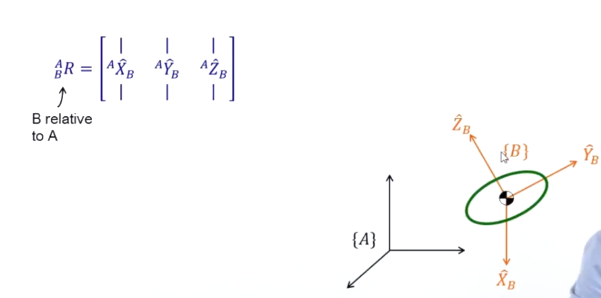
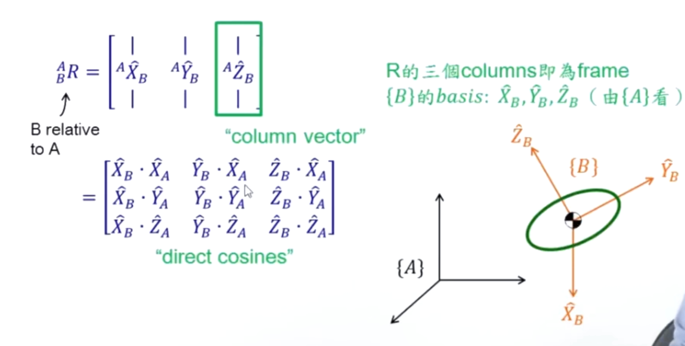
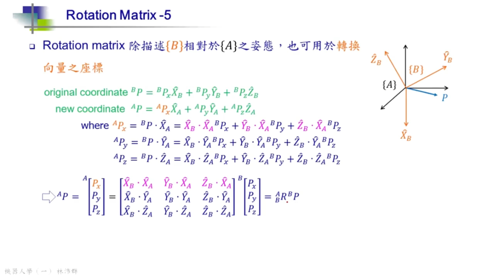

## 矩阵
$
^A_BR
$
 —— 描述｛B｝相对于｛A｝的姿态，或者从A坐标系观察B
 

上标就是从什么视角看，那从A看B的姿态，这个矩阵是用A坐标系表达的

----
那这个矩阵怎么写？
其实就是把B的三个基向量分别在A坐标系的基向量上的投影，转换成A坐标系表达的向量，然后按列向量组合成矩阵。
即下图。

$^A_BR$的逆矩阵$^B_AR$，自然就是从B的角度看A的姿态。
逆运算比较麻烦，但因为R是正交矩阵，正交矩阵的转置（transpose）就等于逆（invert）。

----
提问：
**A坐标系上的点a，在B坐标系上是什么？**

无非就是用矩阵作用一下点a，结果就是答案。
那是用$^A_BR$还是$^B_AR$呢？

是后者，要得到B坐标系的点，得从B角度观察A。
那有时候可能脑子卡壳就是转不过弯来，想不通，可以用特征值来说明一下。

比如：A是世界坐标系，a点是`(1,0,0,1)`，而B是A坐标系向X轴偏移５单位长度的坐标系。

那$^A_BR$就很容易得出：
$$
\begin{pmatrix}
1 & 0 & 0 & 5 \\
0 & 1 & 0 & 0 \\
0 & 0 & 1 & 0 \\
0 & 0 & 0 & 1
\end{pmatrix}
$$

作用到a点，结果是`(6,0,0,1)`，很明显不是我们想要的答案。

那$^B_AR$的矩阵是$^A_BR$的逆：
$$
\begin{pmatrix}
1 & 0 & 0 & -5 \\
0 & 1 & 0 & 0 \\
0 & 0 & 1 & 0 \\
0 & 0 & 0 & 1
\end{pmatrix}
$$
作用a点后，结果是`(-4,0,0,1)`，这是我们想要的答案！

注意：上面的4x4的矩阵，它的逆就不等于它的转置了。

----
证明
