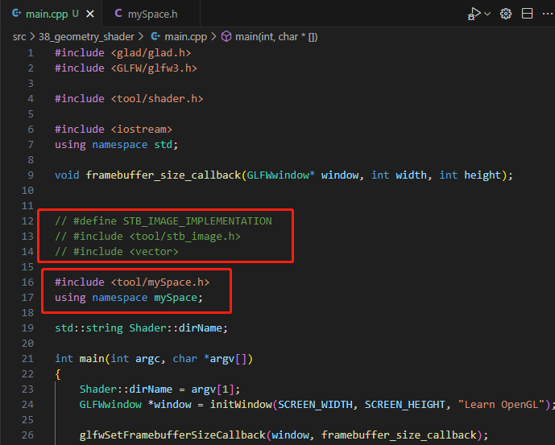
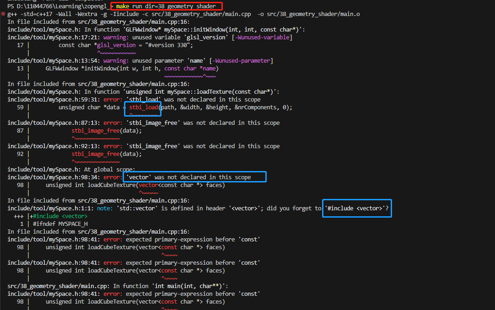

## 注意事项

1. `mySpace.h`

在做到后面时，写了个`mySpace`的命名空间，放一下常用函数和变量等。

然后发现，在新的`main.cpp`中引入这个命名空间`using namespace mySpace;`，如果前面没有导入`glm`的包和`vecotr`，即`#define STB_IMAGE_IMPLEMENTATION  #include <tool/stb_image.h>`和`#include <vector>`，则会报错。

如果在`main.cpp`和`mySpace.h`同时导入缺少的包，也会报错。但只在任一一方导入，则不会报错，但要注意的是，在`main.cpp`中，需要在`using namespace mySpace;`之前导入包，不然还是会报错。