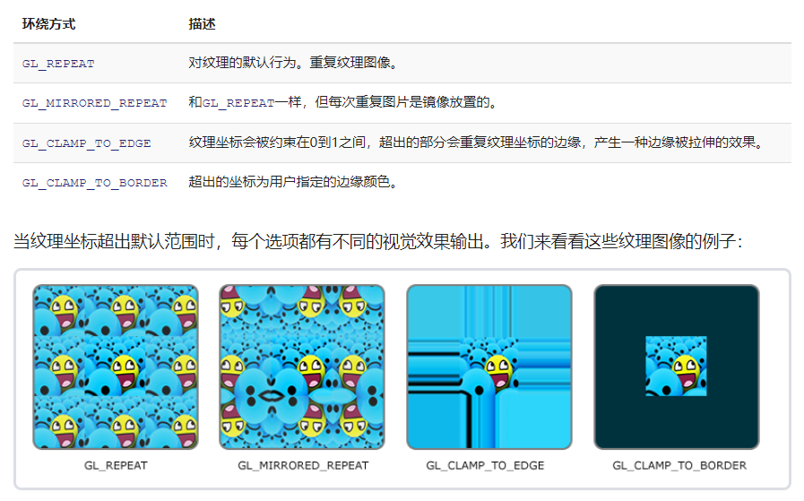

## 知识点回顾

-   专有名词:
    * 纹理坐标 `Texture Coordinate`
    * 片段插值 `Fragment Interpolation`
    * 采样     `Sampling`
    * 纹理环绕 `Texture Wrapping` 
    * 纹理过滤 `Texture Filtering`
    * 纹理像素 `Texture Pixel (Texel)`
    * 多级渐远纹理 `Mipmap`
 

把一张图片的纹理映射`Map`到三角形上，就需要指定三角形每个**顶点**各自对应纹理的哪个部分，这样每个顶点就关联一个**纹理坐标**（始于(0,0)，终于(1,1)）。 
使用纹理坐标获取纹理颜色叫做**采样**

 

-   纹理环绕方式`Texture Wrapping`:
    * `GL_REPEAT`
    * `GL_MMIRRORED_REPEAT`
    * `GL_CLAMP_TO_EDGE` 边缘被拉伸
    * `GL_CLAMP_TO_BORDER` 超出的坐标为用户指定的边缘颜色

 

-   纹理过滤`Texture Filtering`:
    * 邻近过滤(Nearest Neighbor Filtering)
    * 线性过滤(Linear Filtering)

当进行放大`(Magnify)`和缩小`(Minify)`的操作时都可以设置纹理过滤的选项。

纹理坐标不依赖于分辨率(Resolution)，它可以是任意浮点值，因此OpenGL需要知道怎么将纹理像素`Texture Pixel (Texel)`映射到纹理坐标上，那这就是纹理过滤`Texture Filtering`的作用。

Texel：想象一张打开的`.jpg`图片，不断放大就可能看到无数的像素点，这就是纹理像素。

注意不要和纹理坐标搞混，纹理坐标是你给模型顶点设置的那个数组，OpenGL以这个顶点的纹理坐标数据去查找纹理图像上的像素，然后进行采样提取纹理像素的颜色。

-   [多级渐远纹理`Mipmap`](https://zhuanlan.zhihu.com/p/351712352):
Mipmap是一系列纹理，每个纹理都是同一图像的分辨率逐渐降低的表示形式。

在两种不同级别的多级渐远纹理层之间会产生不真实的生硬边界，就跟普通纹理过滤一样，切换多级渐远纹理级别时也可以在这之间使用NEAREST和LINEAR过滤。
过滤方式有：
* GL_NEAREST_MIPMAP_NEAREST 使用最邻近的多级渐远纹理来匹配像素大小，并使用邻近插值进行纹理采样
* GL_LINEAR_MIPMAP_NEAREST 使用最邻近的多级渐远纹理级别，并使用线性插值进行纹理采样
* GL_NEAREST_MIPMAP_LINEAR 在两个最匹配像素大小的多级渐远纹理之间进行线性插值，使用邻近插值进行采样
* GL_LINEAR_MIPMAP_LINEAR 在两个邻近的多级渐远纹理之间使用线性插值，并进行线性插值进行采样

注意：放大过滤不可以设置多级渐远过滤的选项，设置了不仅没效果，还会产生错误代码。因此也得知多级渐远纹理主要是使用在纹理被缩小的情况下的。

