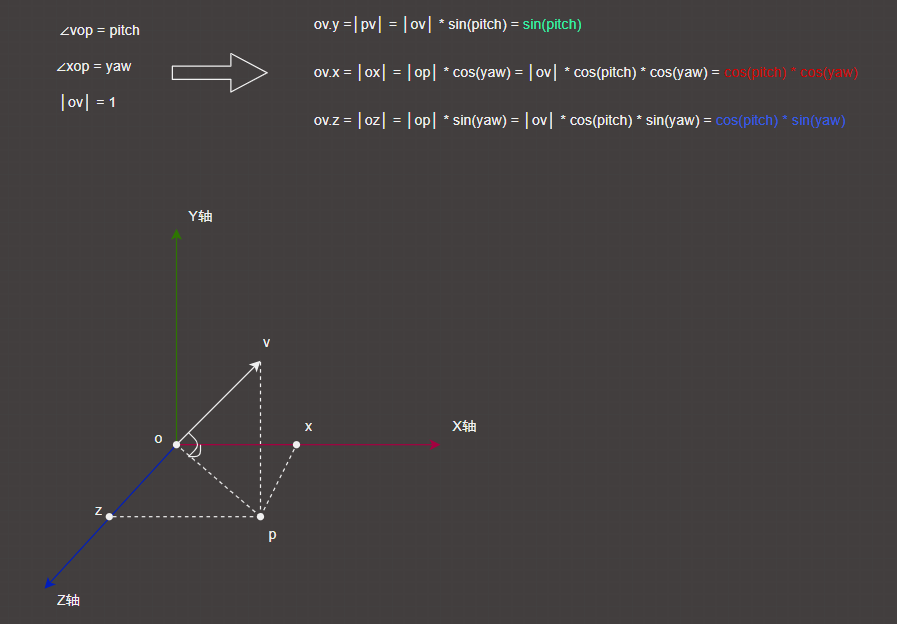

## 知识点回顾

相机矩阵的由来：找到三个正交的向量作为相机坐标系的坐标轴，再提供一个相机位置，就构成相机矩阵了。相机的右向量（Right），上向量（Up），前向量（Forward），以及相机的位置（Position）
-   先定义一个`up向量`，这决定场景中物体的向上的方向是什么。很多3D库是用世界坐标轴Y轴`(0,1,0)`作为up向量的，但一般习惯说上方向是指Z轴`(0,0,1)`
-   以相机观察的目标，到相机的方向，作为坐标系的Z轴`F`（注意相机Z轴的朝向，一般和相机观察方向相反）
-   用up向量和Z轴叉乘，得到右向量(Right)，作为坐标系的X轴`R`
-   Z轴叉乘X轴，得到坐标系的Y轴`U`
-   最后组成相机矩阵

$$
\begin{pmatrix}
R_x & R_y & R_z & -P_x \\
U_x & U_y & U_z & -P_y \\
F_x & F_y & F_z & -P_z \\
0 & 0 & 0 & 1
\end{pmatrix}
$$

**需要注意的是：** glm的矩阵是列优先存储的。而数学上的n行m列，对应glm矩阵mat应该是`mat[m][n]`;
(glm_io.hpp文件输出的矩阵，是数学上的书写格式)

------

在"move the cube by keyboard up down left right"篇中，有个灵异事件...

`lookAt`方法会用到下图几个变量，如果使用上面的声明创建，得到的矩阵会有`NaN`，下面的声明则没问题。但是吧，不管上面还是下面的声明创建，输出出来的都没毛病啊。

--------

基于俯仰角和偏航角的方向向量：
（ov代表摄像机的前轴Front）

