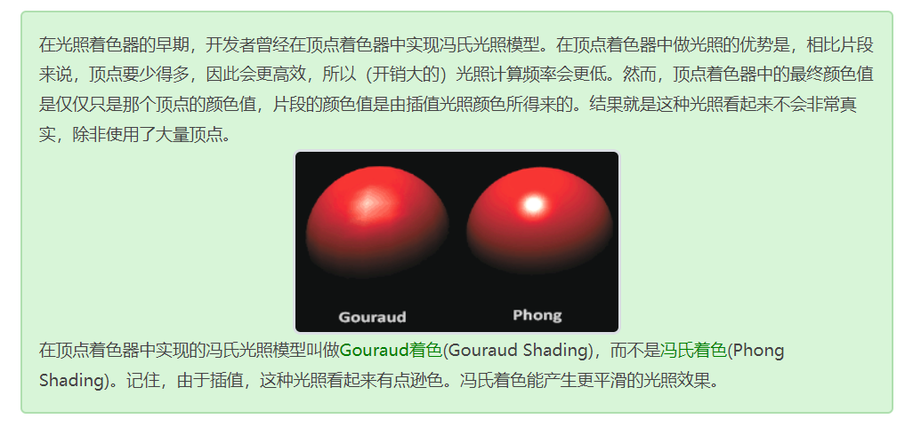

### 回顾

冯氏`Phong`光照模型有两种着色方法：Gouraud着色`Gouraud Shading`和冯氏着色`Phong Shading`。

两者实现的区别就在于前者在顶点着色器中计算出光照颜色，而后者是在片段着色器中计算。

 

但为什么冯氏着色应用更广泛？

在顶点着色器中做光照的优势是，相比片段来说，顶点要少得多，因此会更高效，所以（开销大的）光照计算频率会更低。
然而Gouraud着色在顶点着色器计算的颜色，是**顶点的颜色**，而冯氏着色计算出的光照颜色，会经过插值计算，得到的是**片段的颜色**，如此后者会比前者显得更加真实。
当然，也可以通过**增加大量顶点个数**，让Gouraud着色效果显得真实。

 

