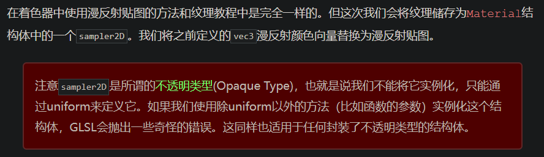

## 回顾

### 光照贴图

上一节中的材质系统，肯定是无法满足模拟显示的需求。这里引入**漫反射**和**镜面光**贴图`(Map)`。这允许我们对物体的漫反射分量（以及间接地对环境光分量，它们几乎是一样的）和镜面光分量有着更精确的控制。

### 漫反射贴图

其实贴图就是纹理`(Texture)`，基本原理都是使用一张覆盖物体的图像，让开发者能够逐片段索引物体独立的颜色值。在光照场景中，它通常叫做漫反射贴图`(Diffuse Map)`。

;

因为**环境光颜色在几乎所有情况下都等于漫反射颜色**，所以不需要将它们分开存储：
```
struct Material
{
    sampler2D diffuse;
    vec3 specular;
    float shininess;
};
```

### 镜面光贴图

物体反射出来的镜面光是一个系数`spec` 乘以 **物体的镜面材质**，再乘以**光源的镜面光分量**得出的。

`vec3 specular = (spec * material0.specular) * light0.specular;`

我们可以通过控制物体镜面材质，来控制物体镜面光反射效果，这里做法其实就和前面控制物体漫反射效果的做法是相似的。

镜面高光的强度可以通过图像每个像素的亮度来获取。镜面光贴图上的每个像素都可以由一个**颜色向量**来表示，比如说黑色代表颜色向量vec3(0.0)，灰色代表颜色向量vec3(0.5)。**在片段着色器中，我们接下来会取样对应的颜色值并将它乘以光源的镜面强度。一个像素越「白」，乘积就会越大，物体的镜面光分量就会越亮。**

-----

-----

这章节用了imgui来调节参数，出现了几个前面教程评论区说的问题，就在这里记录下来。

### 当shininess == 0 时，立方体侧面会直接变黑
