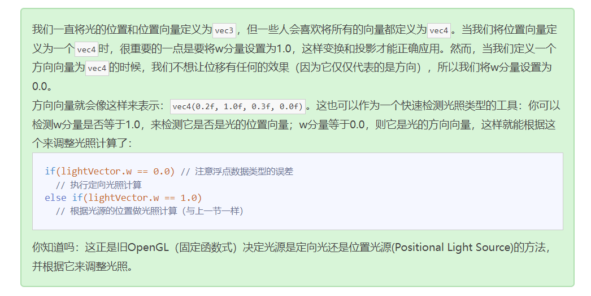

## 回顾

openGL 判断光源传进来的是位置信息还是方向信息，是通过`vec4`的`w`分量，等于 1.0 是位置信息，等于 0.0 是方向信息。



---

```c++
    // 定义十个不同的箱子位置
    glm::vec3 cubePositions[] = {
        glm::vec3(0.0f, 0.0f, 0.0f),
        glm::vec3(2.0f, 5.0f, -15.0f),
        glm::vec3(-1.5f, -2.2f, -2.5f),
        glm::vec3(-3.8f, -2.0f, -12.3f),
        glm::vec3(2.4f, -0.4f, -3.5f),
        glm::vec3(-1.7f, 3.0f, -7.5f),
        glm::vec3(1.3f, -2.0f, -2.5f),
        glm::vec3(1.5f, 2.0f, -2.5f),
        glm::vec3(1.5f, 0.2f, -1.5f),
        glm::vec3(-1.3f, 1.0f, -1.5f)
    };
```
