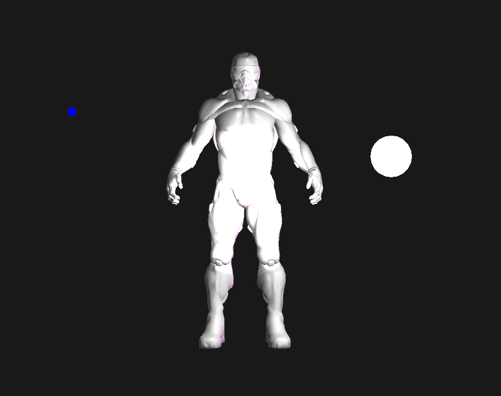
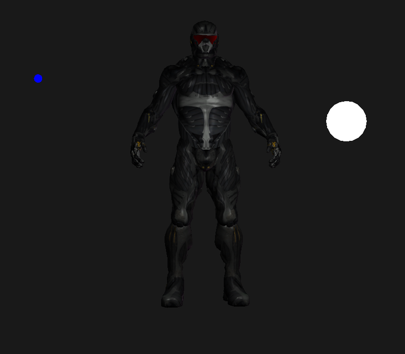

## 回顾

### 导入模型

一个非常流行的模型导入库：`Open Asset Import Library`（开放的资产导入库），简称`Assimp`。

当使用Assimp导入模型时，它会将整个模型加载进一个**场景**`Scene`对象中，这之中包含了所有数据。

[Assimp数据结构模型如下：](https://learnopengl-cn.github.io/03%20Model%20Loading/01%20Assimp/)

-   所有数据都包含在`Scene`对象中
-   根节点`RootNode`可能包含子节点，会有一些列指向`Scene`对象中`mMeshes`数组中存储网格数据的**索引**。也就是说mesh数据存在**Scene对象**中的`mMeshes`数组，而**根节点RootNode**的`mMeshes`数组只是存储索引。
-   一个Mesh对象本身包含了渲染所需的所有相关数据，顶点位置，法向量，纹理坐标，面`Face`和材质
-   一个Mesh包含很多面。`Face`代表的是物体的**渲染图元**`(Primitive)`（三角形，方形，点）。一个面包含了组成图元的顶点的**索引**。由于顶点和索引是分开的，使用索引缓冲来渲染会方便很多。
-   最后，一个网格也包含一个`Material`对象，它包含了一些函数能让我们获取物体的材质属性，比如说颜色和纹理贴图（比如漫反射和镜面光贴图）。

---------

2024年7月5日：看教程写的`model`类，提到加载纹理时，约定在着色器中采样器`sampler`的名称是以`texture_ + 纹理类型 + 数量编号`，例如第一个漫反射纹理，则是`texture_diffuse1`，而教程中提供的片段着色器就是如此命名采样器的，以及`mesh`类中，给着色器`setInt`的第一个参数采样器名称，也是对应上的。

但是吧，我跟B站up主的片段着色器代码，却没发现如此命名的采样器。

而在教程里的片段着色器，纹理采样器只用到一个`texture_diffuse1`，也就是说，整个加载模型的过程中，每个`mesh`都只用到了一个纹理。而在[纹理](https://learnopengl-cn.github.io/01%20Getting%20started/06%20Textures/)那一课中提到，如果只有一个纹理单元，则默认激活`GL_TEXTURE0`，并把纹理数据给到着色器中的采样器`Sampler2D`。那这里不管是否有进行setInt，以及setInt的第一个参数是否正确，在当前的情况下，都无所谓。因为纹理数据，会默认给到片段着色器的**第一个**采样器`Sampler2D`（我猜如果有多个`Sampler2D`，也无所谓，没纹理数据，采不到纹理像素，返回白色？），只要片段着色器应用了（所有）采样器，那就能采集到片段颜色，模型就加载正常了。

然后在该节中的`fragment.glsl`，有3个采样器，声明的先后顺序是`material.diffuse`、`material.specular`、`awesomeMap`，然后这3个采样器都用上了，模型显示正常。

接着，我先把`awesomeMap`的给注释掉，显示仍然正常。于是我又把`material.diffuse`的给注释掉，这次显示就不正常了。

