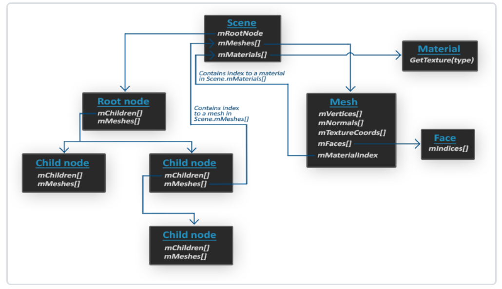

## 回顾

### 导入模型

一个非常流行的模型导入库：`Open Asset Import Library`（开放的资产导入库），简称`Assimp`。

当使用Assimp导入模型时，它会将整个模型加载进一个**场景**`Scene`对象中，这之中包含了所有数据。

[Assimp数据结构模型如下：](https://learnopengl-cn.github.io/03%20Model%20Loading/01%20Assimp/)

-   所有数据都包含在`Scene`对象中
-   根节点`RootNode`可能包含子节点，会有一些列指向`Scene`对象中`mMeshes`数组中存储网格数据的**索引**。也就是说mesh数据存在**Scene对象**中的`mMeshes`数组，而**根节点RootNode**的`mMeshes`数组只是存储索引。
-   一个Mesh对象本身包含了渲染所需的所有相关数据，顶点位置，法向量，纹理坐标，面`Face`和材质
-   一个Mesh包含很多面。`Face`代表的是物体的**渲染图元**`(Primitive)`（三角形，方形，点）。一个面包含了组成图元的顶点的**索引**。由于顶点和索引是分开的，使用索引缓冲来渲染会方便很多。
-   最后，一个网格也包含一个`Material`对象，它包含了一些函数能让我们获取物体的材质属性，比如说颜色和纹理贴图（比如漫反射和镜面光贴图）。