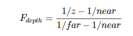
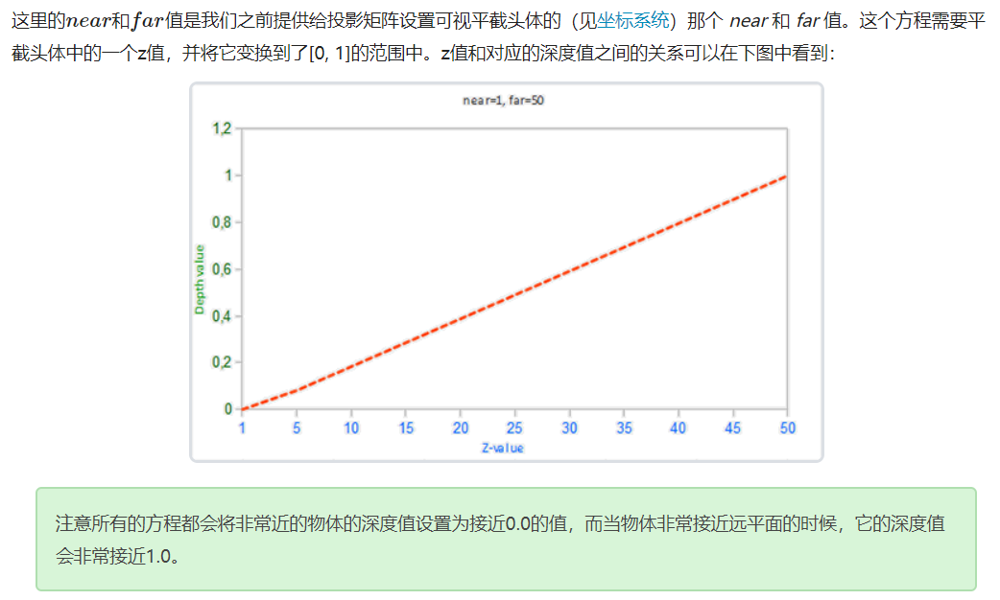
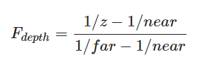
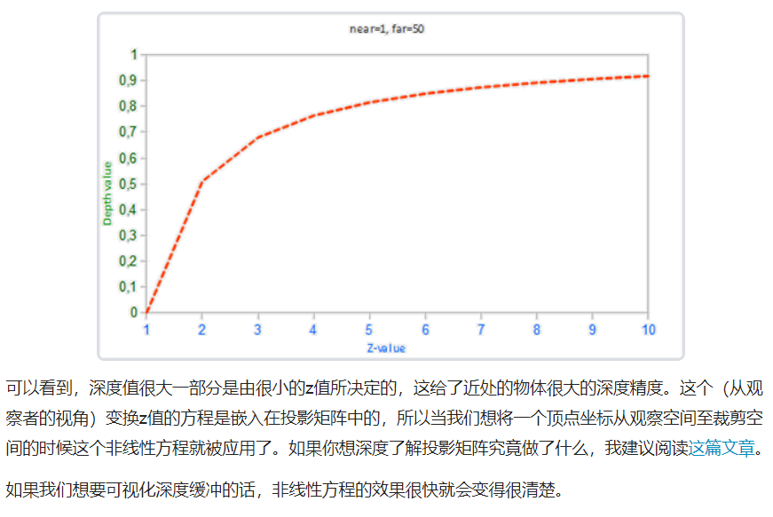
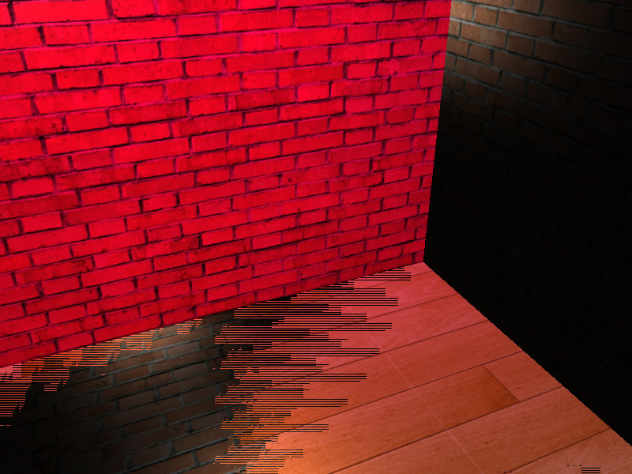

## 深度测试

深度测试函数：

| 函数        | 描述                                         |
| :---------- | :------------------------------------------- |
| GL_ALWAYS   | 永远通过深度测试                             |
| GL_NEVER    | 永远不通过深度测试                           |
| GL_LESS     | 在片段深度值小于缓冲的深度值时通过测试       |
| GL_EQUAL    | 在片段深度值等于缓冲区的深度值时通过测试     |
| GL_LEQUAL   | 在片段深度值小于等于缓冲区的深度值时通过测试 |
| GL_GREATER  | 在片段深度值大于缓冲区的深度值时通过测试     |
| GL_NOTEQUAL | 在片段深度值不等于缓冲区的深度值时通过测试   |
| GL_GEQUAL   | 在片段深度值大于等于缓冲区的深度值时通过测试 |

```glsl
  glEnable(GL_DEPTH_TEST);
  glDepthFunc(GL_ALWAYS);
```

## 深度值精度

**线性深度缓冲(Linear Depth Buffer)**

将范围在`[near, far]`之间的z值变换到范围`[0,1]`之间。






但在实际的使用过程中，很少用到这个**线性深度缓冲**。

想要有正确的投影性质，需要使用一个**非线性**的深度方程，它是与`1/z`成正比的。它做的就是在z值很小的时候提供非常高的精度，而在z值很远的时候提供更少的精度。

花时间想想这个：我们真的需要对1000单位远的深度值和只有1单位远的充满细节的物体使用相同的精度吗？线性方程并不会考虑这一点。

由于非线性方程与 1/z 成正比，在1.0和2.0之间的z值将会变换至1.0到0.5之间的深度值，这就是一个float提供给我们的一半精度了，这在z值很小的情况下提供了非常大的精度。在50.0和100.0之间的z值将会只占2%的float精度，这正是我们所需要的。这样的一个考虑了远近距离的方程是这样的：






----------

## openGL编程的一些技巧

-   前面有过一次绘制10个Box，就构建了10个BoxGeometry对象，然后在while循环中，每个对象都`glDrawElements`。但今天发现并仅需要构建1个对象，在循环中，需要Draw多少个box，就`glDrawElements`就行。
-   之前章节也提过，在main函数中加载的纹理Texture，要传给着色器，如果说不是一个片段需要同时用到2个及以上的纹理，可以不需要通过setInt来传递纹理。比如画一个平面用到texture1，那就在平面glDrawElements之前，绑定下纹理`glBindTexture`即可，甚至激活0号默认的纹理单元都可以省略。


## 深度冲突

深度缓冲没有足够的精度来决定两个形状哪个在前面。



**解决办法**

1. 不要把多个物体摆得太靠近，以至于它们的一些三角形会重叠。
2. 尽可能将近平面设置远一些。
3. 使用更高精度的深度缓冲。

## 参考

https://learnopengl-cn.github.io/04%20Advanced%20OpenGL/01%20Depth%20testing/
