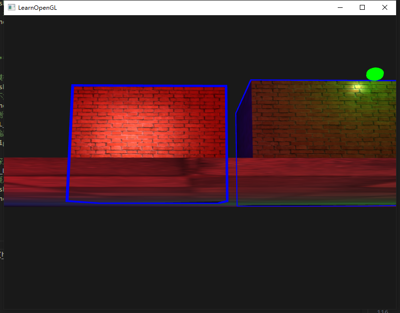
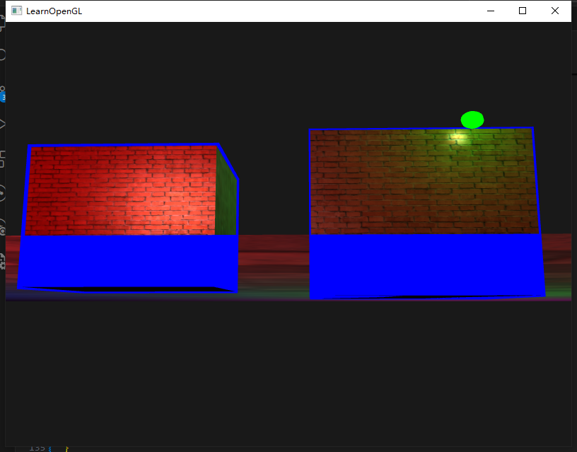

## stencil test

当片段着色器运行完，会进行模板测试和深度测试，二者都能决定片段的保留或丢弃(discard)，因此只有通过模板测试的片段才会进入深度测试。

模板测试是根据一个模板缓冲(Stencil Buffer)进行的，GLFW 会给每个窗口默认配置一个模板缓冲，因此无需手动创建 buffer。

**开启/关闭模板缓冲**

```cpp
glEnable(GL_STENCIL_TEST);
glDisable(GL_STENCIL_TEST);
```

渲染的每个循环开头，都应该先**清除上一循环留下的模板缓冲**

```cpp
glClear(GL_STENCIL_BUFFER_BIT);
```

模板缓冲允许**读取**和**写入**，但在**写入**之前会**先与设定好的掩码 Mask 进行与(AND)运算**

```cpp
glStencilMask(0xFF);    // 写入模板缓冲时保持原样
glStencilMask(0x00);    // 写入的都变成0，和深度测试的glDepthMask(GL_FALSE)等价
```

### 模板函数

```cpp
// ********************** 描述OpenGL应该对模板缓冲内容做什么操作 **********************

/**
 *  @param func 测试函数。值有GL_LESS, GL_EQUAL, GL_NOTEQUAL等，测试函数会将缓冲中的模板值和ref比较
 *  @param ref int型参数。
 *  @param mask 掩码。模板值和ref比较前会先和mask进行与(AND)运算。
 */
glStencilFunc(GLenum func, GLint ref, GLuint mask);


// 如果当前模板值等于（GL_EQUAL）1，则通过模板测试
glStencilFunc(GL_EQUAL, 1, 0XFF);


// ********************** 描述应该如何更新缓冲 **********************
/**
 *  @param sfail    模板测试不通过采取的行为
 *  @param dpfail   模板测试通过但深度测试不通过采取的行为（先进行的模板测试，后深度测试）
 *  @param dppass   模板和深度测试都通过采取的行为
 */
glStencilOp(GLenum sfail, GLenum dpfail, GLenum dppass);

```

<br>

`glStencilFunc`函数第一个参数的 GLenum 值

| 函数        | 描述                                         |
| :---------- | :------------------------------------------- |
| GL_ALWAYS   | 永远通过模板测试                             |
| GL_NEVER    | 永远不通过模板测试                           |
| GL_LESS     | 在片段模板值小于缓冲的模板值时通过测试       |
| GL_EQUAL    | 在片段模板值等于缓冲区的模板值时通过测试     |
| GL_LEQUAL   | 在片段模板值小于等于缓冲区的模板值时通过测试 |
| GL_GREATER  | 在片段模板值大于缓冲区的模板值时通过测试     |
| GL_NOTEQUAL | 在片段模板值不等于缓冲区的模板值时通过测试   |
| GL_GEQUAL   | 在片段模板值大于等于缓冲区的模板值时通过测试 |

<br>

`glStencilOp`函数的 GLenum 值

| 函数         | 描述                                                   |
| :----------- | :----------------------------------------------------- |
| GL_KEEP      | 保持当前储存的模板值                                   |
| GL_ZERO      | 将模板值设置为 0                                       |
| GL_REPLACE   | 将模板值设置为 glStencilFunc 函数设置的 ref 值         |
| GL_INCR      | 如果模板值小于最大值则将模板值加 1                     |
| GL_INCR_WRAP | 与 GL_INCR 一样，但如果模板值超过了最大值则归零        |
| GL_DECR      | 如果模板值大于最小值则将模板值减 1                     |
| GL_DECR_WRAP | 与 GL_DECR 一样，但如果模板值小于 0 则将其设置为最大值 |
| GL_INVERT    | 按位翻转当前的模板缓冲值                               |

<br>
<br>

### 物体轮廓(Object Outlining)

能完整展现模板测试特性的功能，物体轮廓。

```cpp
glEnable(GL_STENCIL_TEST);
// 当缓冲模板值不为1时通过测试（通过则并且通过深度测试则绘制片段）
glStencilFunc(GL_NOTEQUAL, 1, 0Xff);
// 第二个参数模板测试通过但深度测试不通过，则保留模板值     这里会有一个问题，后面补充
glStencilOp(GL_KEEP, GL_KEEP, GL_REPLEACE);
while (!glfwWindowShouldClose(window))
{
    // （循环前先清空模板缓冲，此时缓冲中均为0）  这是之前的想法。。。错了，不清空则使用上次循环的模板缓冲，这都忘了啊
    glClear(GL_STENCIL_BUFFER_BIT);

    // *********** 先绘制不需要轮廓的物体 ***********

    // 不更新模板缓冲
    glStencilMask(0x00);
    drawFloor();

    // *********** 绘制需要轮廓的物体 ***********

    // 更新模板缓冲
    glStencilMask(0xff);
    // 总是通过，并更新缓冲为1 （如果物体片段深度测试也通过，则绘制）
    glStencilFunc(GL_ALWAYS, 1, 0xff);
    // 绘制物体
    drawCube();

    // *********** 绘制轮廓 ***********

    // 关闭更新模板缓冲
    glStencilMask(0x00);
    // 当缓冲值不为1时，通过测试
    glStencilFunc(GL_NOTEQUAL, 1, 0xff);
    // 关闭深度测试，防止边框被遮挡
    glDisable(GL_DEPTH_TEST);
    // 更换一个输出单颜色的着色器，绘制放大一些些的cube
    drawLittleBiggerCubeWithSingleColorShader();

    // 重新打开深度测试
    glEnable(GL_DEPTH_TEST);
    // 清空模板缓冲
    glStencilMask(0xff);
    glStencilFunc(GL_ALWAYS, 0, 0xff);
}
```

`glStencilOp`第二个参数，`GL_REPLEACE`和`GL_KEEP`的区别。

<center>



<small>`GL_REPLEACE`</small>



<small>`GL_KEEP`</small>

</center>

[可参考知乎答案](https://zhuanlan.zhihu.com/p/612811622)