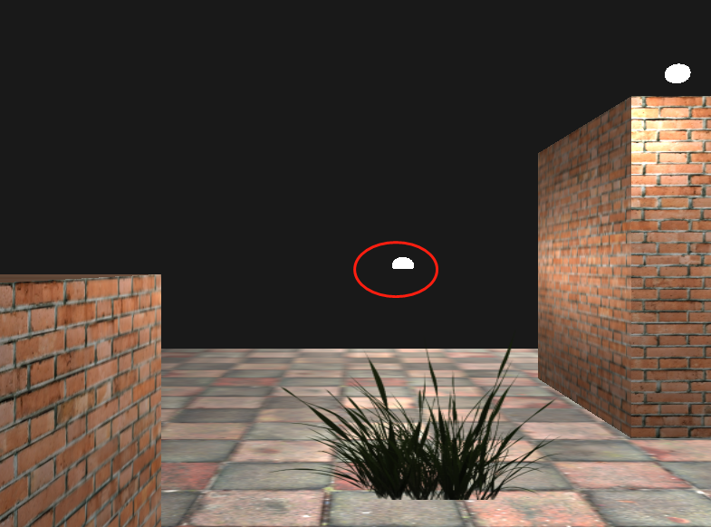

## 混合 Blending

OpenGL 中，混合(Blending)通常是实现物体透明度(Transparency)的一种技术。

纹理有三个颜色分量：红绿蓝。但有些材质会有一个内嵌的`alpha`通道，对每个纹理像素(Texel)都包含一个alpha值，它精确地告诉 openGL 纹理各个部分的透明度。

### 问题
有个问题暂时想不通：场景创建了一个平面，加载了grass.png图片，然后就出现了一个神奇的现象：图片透明部分，不能挡住地板或砖块，但能挡住运动的光源球...

这里可以**把alpha值小于某个阈值的片段丢弃`discard`掉**，解决挡住光源的问题

```
if(color.a < 0.1)
    discard;
```

想了下，代表光源的球型几何，与地板和砖块，唯一不同的就是用到着色器不同



这里的问题与着色器无关。

原因在于深度测试。
当写入深度缓冲时，深度缓冲不会检查片段是否透明，所以透明部分会和其他值一样写入深度缓冲中。
在main函数的循环中，草用的着色器和地板、砖块用的是一样的，而光源球用的是另一套着色器，于是为了方便，我就把光源放在循环的最后面渲染，而草放在地板砖块之后，光源之前，这就导致了草能挡住光源球，却不能挡住地板砖块的现象。

(但其实，对于草这样的材质贴图，有全透明的片段，就应该选择丢弃，而不是混合)


### 混合

上面提到，不要的片段丢弃，可以实现透明效果，但无法实现半透明效果。这里就要启用混合`glEnable(GL_BLEND);`

开启后，还要告诉OpenGL如何混合：


<br>
<br>
<br>
<br>

-----

好久不接触 cpp，好多语法都忘了。。。
类的构造函数，参数列表有默认值，在创建该类的对象时，可直接声明，不需传参，**也不需要一对小括号**

```
PlaneGeometry plane1(1.0, 1.0, 1.0, 1.0);   // √
PlaneGeometry plane1;                       // √
PlaneGeometry plane1();                     // ×
```
