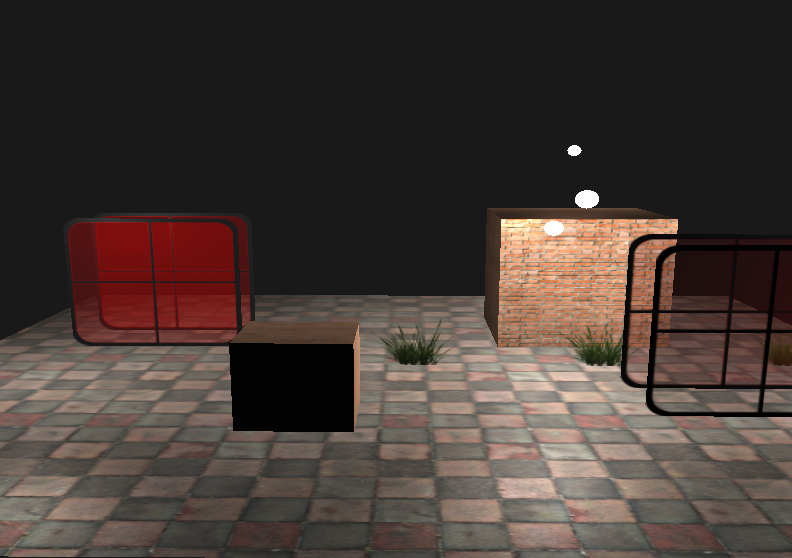
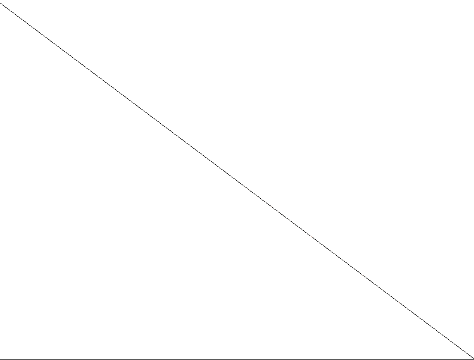
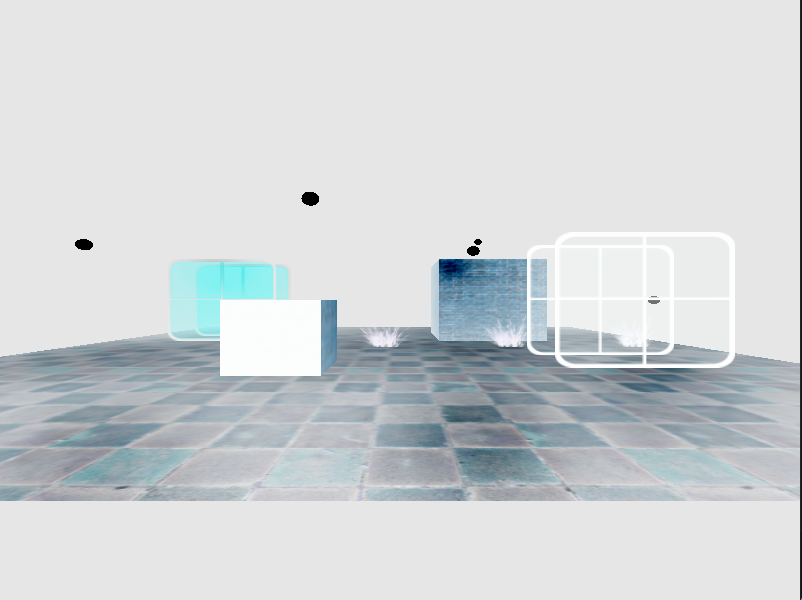
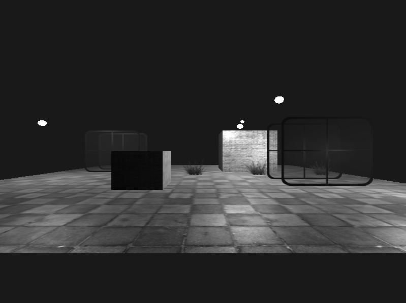
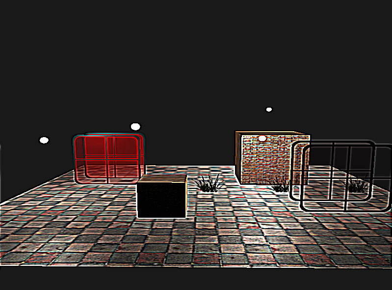
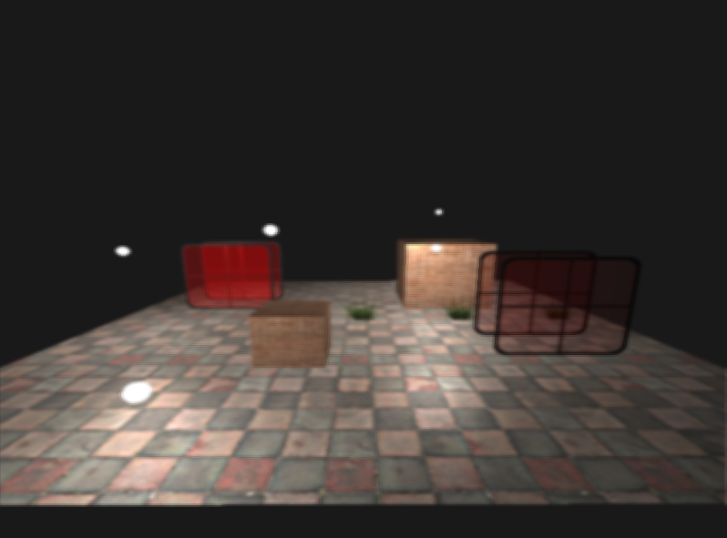
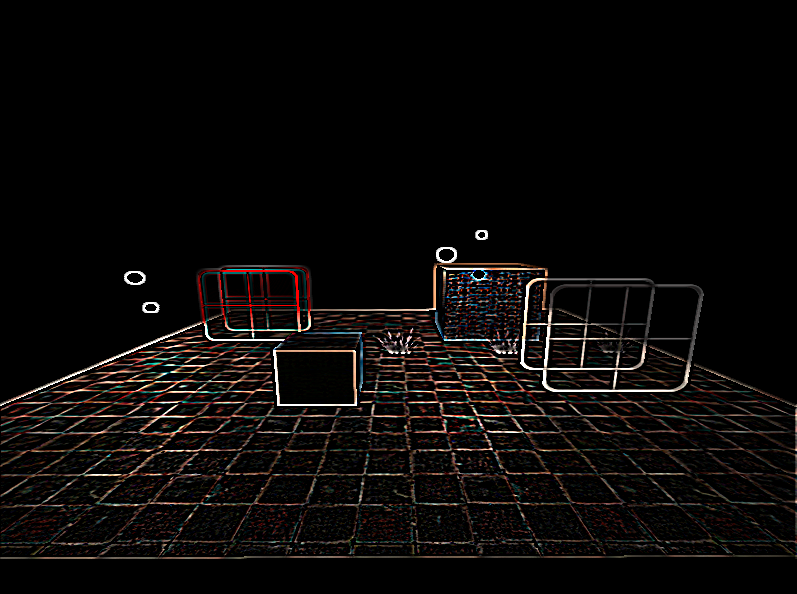
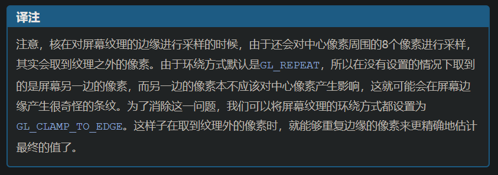

## 帧缓冲

### 创建帧缓冲

```c++
unsigned int fbo;
glGenFramebuffers(1, &fbo);
glBindFramebuffer(GL_FRAMEBUFFER, fbo);
```

一个完整的帧缓冲需要满足以下条件：

- 附加至少一个缓冲（颜色、深度、模板缓冲）
- 至少有一个颜色附件（Attachment）
- 所有附件都必须是完整的（保留了内存）
- 每个缓冲都应该有相同的样本数量（sample）

上述条件都满足后，可以通过下面的方式判断帧缓冲是否完整。

```c++
glCheckFramebufferStatus(GL_FRAMEBUFFER) == GL_FRAMEBUFFER_COMPLETE
```

### 纹理附件

附件是一个内存位置，它能够作为帧缓冲的一个缓冲，可以将它想象为一个图像。

```c++
// 创建纹理附件
unsigned int texBuffer;
glGenTextures(1, &texBuffer);
glBindTexture(GL_TEXTURE_2D, texBuffer);
// 这里和生成纹理的区别有几点：
// 1.将维度设置为屏幕大小 2.最后一个纹理data参数传NULL。
// 这个操作，仅仅给纹理分配了内存，而没有填充它。
// 填充纹理将会在渲染到帧缓冲之后进行
glTexImage2D(GL_TEXTURE_2D, 0, GL_RGB, SCREEN_WIDTH, SCREEN_HEIGHT, 0, GL_RGB, GL_UNSIGNED_BYTE, NULL);
glTexParameteri(GL_TEXTURE_2D, GL_TEXTURE_MIN_FILTER, GL_LINEAR);
glTexParameteri(GL_TEXTURE_2D, GL_TEXTURE_MAG_FILTER, GL_LINEAR);
```

**将颜色纹理附加到当前绑定的帧缓冲上**

```c++
// 1.帧缓冲的目标（绘制、读取或二者都有） 2.想要附加的附件类型 3.希望附加的纹理类型 4.纹理 5.多级渐远纹理级别
glFramebufferTexture2D(GL_FRAMEBUFFER, GL_COLOR_ATTACHMENT0, GL_TEXTURE_2D, texBuffer, 0);
```

**将深度和模板缓冲附加为一个纹理到帧缓冲中**

```c++
// 纹理每32位数值将包含24位深度信息和8位模板信息。
// 将深度和模板缓冲附加为一个纹理
glTexImage2D(GL_TEXTURE_2D, 0, GL_DEPTH24_STENCIL8, SCREEN_WIDTH, SCREEN_HEIGHT, 0, GL_DEPTH_STENCIL, GL_UNSIGNED_INT_24_8, NULL);
glFramebufferTexture2D(GL_FRAMEBUFFER, GL_DEPTH_STENCIL_ATTACHMENT, GL_TEXTURE_2D, texBuffer, 0);
```

### 设置渲染缓冲对象

```c++
// 渲染缓冲对象
unsigned int rbo;
glGenRenderbuffers(1, &rbo);
// 绑定渲染缓冲对象，之后所有渲染缓冲操作将影响当前的rbo
glBindRenderbuffer(GL_RENDERBUFFER, rbo);
// 创建一个深度和模板渲染缓冲对象
glRenderbufferStorage(GL_RENDERBUFFER, GL_DEPTH24_STENCIL8, SCREEN_WIDTH, SCREEN_HEIGHT);
glBindRenderbuffer(GL_RENDERBUFFER, 0);
// 将渲染缓冲对象附加到帧缓冲的深度和模板附件上
glFramebufferRenderbuffer(GL_FRAMEBUFFER, GL_DEPTH_STENCIL_ATTACHMENT, GL_RENDERBUFFER, rbo);

if(glCheckFramebufferStatus(GL_FRAMEBUFFER) != GL_FRAMEBUFFER_COMPLETE)
{
    std::cout<<"ERROR::Framebuffer is not complete!" << std::endl;
}
glBindFramebuffer(GL_FRAMEBUFFER, 0);
```

**渲染循环**

```c++
while(){
    // 第一处理阶段
    // 绑定自定义的帧缓冲
    glBindFramebuffer(GL_FRAMEBUFFER, fbo);
    glEnable(GL_DEPTH_TEST);

    glClearColor(clear_color.x, clear_color.y, clear_color.z, clear_color.w);
    glClear(GL_COLOR_BUFFER_BIT | GL_DEPTH_BUFFER_BIT);

    // 正常绘制场景
    drawScene...

    // 第二处理阶段
    // 绑定默认的帧缓冲对象
    glBindFramebuffer(GL_FRAMEBUFFER, 0);
    // 需关闭深度测试
    // disable depth test so screen-space quad isn't discarded due to depth test.
    glDisable(GL_DEPTH_TEST);

    glClearColor(1.0f, 1.0f, 1.0f, 1.0f);
    glClear(GL_COLOR_BUFFER_BIT);

    frameBufferShader.use();//绘制创建的帧缓冲屏幕窗口
    glBindVertexArray(frameGeometry.VAO);
    glBindTexture(GL_TEXTURE_2D, texColorBuffer);
    glDrawElements(GL_TRIANGLES, frameGeometry.indices.size(), GL_UNSIGNED_INT, 0);
}
```

综上，以及`main.cpp`，算是弄明白《帧缓冲章节》在<后期处理>之前的内容的意思。大概来讲就是，在之前章节学习到的绘制场景的操作，本来都是直接渲染到默认帧缓冲对象上，然后输出到屏幕的，现在是把这些渲染到自定义的帧缓冲对象`fbo`中，**即第一处理阶段**；接着切换回默认的帧缓冲对象，把和屏幕大小的平面`frameGeometry`渲染到屏幕上，并把自定义帧缓冲对象的内容以纹理的方式给到这个平面，**即第二处理阶段**。

那最终的效果和之前没太大差别，这里可以通过切换渲染模式，来看此次学习内容的效果。

```c++
// 线框模式
glPolygonMode(GL_FRONT_AND_BACK, GL_LINE);
// 普通模式
glPolygonMode(GL_FRONT_AND_BACK, GL_FILL);
```

**普通模式**



**线框模式**



**vertex shader**

```glsl
#version 330 core
layout(location = 0) in vec3 Position;
layout(location = 1) in vec3 Normal;
layout(location = 2) in vec2 TexCoords;
out vec2 outTexCoord;

void main() {
    gl_Position = vec4(Position.x, Position.y, 0.0f, 1.0f);
    outTexCoord = TexCoords;
}
```

**fragment shader**

```glsl
#version 330 core
out vec4 FragColor;
in vec2 outTexCoord;

uniform sampler2D screenTexture;

void main() {
    FragColor = texture(screenTexture, outTexCoord);
}
```

<br>
<br>

---

## 后期处理

### 反相

```glsl
vec3 texColor = 1.0 - texture(screenTexture, outTexCoord).rgb;
FragColor = vec4(texColor, 1.0);
```



<br>
<br>

### 灰度

```glsl
vec3 texColor = texture(screenTexture, outTexCoord).rgb;
float average = 0.2126 * texColor.r + 0.7152 * texColor.g + 0.0722 * texColor.b;
FragColor = vec4(vec3(average), 1.0);
```




<br>
<br>

### 核效果

核(Kernel)（或卷积矩阵(Convolution Matrix)）是一个类矩阵的数值数组，它的中心为当前的像素，它会用它的核值乘以周围的像素值，并将结果相加变成一个值。所以，基本上我们是在对当前像素周围的纹理坐标添加一个小的偏移量，并根据核将结果合并。
下面是核的一个例子：


$$
\begin{pmatrix}
2 & 2 & 2 \\
2 & -15 & 2 \\
2 & 2 & 2 \\
\end{pmatrix}
$$

这个核取了8个周围像素值，将它们乘以2，而把当前的像素乘以-15。这个核的例子将周围的像素乘上了一个权重，并将当前像素乘以一个比较大的负权重来平衡结果。

你在网上找到的大部分核将所有的权重加起来之后都应该会等于1，如果它们加起来不等于1，这就意味着最终的纹理颜色将会比原纹理值更亮或者更暗了。

<br>

#### 锐化核

```glsl
#version 330 core
out vec4 FragColor;
in vec2 outTexCoord;

uniform sampler2D screenTexture;

const float offset = 1.0 / 300.0;
void main() {
    // 核效果
    // 锐化(Sharpen)核
    const float offset = 1.0 / 300.0;
    vec2 offsets[9] = vec2[](
        vec2(-offset,  offset), // 左上
        vec2( 0.0f,    offset), // 正上
        vec2( offset,  offset), // 右上
        vec2(-offset,  0.0f),   // 左
        vec2( 0.0f,    0.0f),   // 中
        vec2( offset,  0.0f),   // 右
        vec2(-offset, -offset), // 左下
        vec2( 0.0f,   -offset), // 正下
        vec2( offset, -offset)  // 右下
    );
    float kernel[9] = float[](
        -1, -1, -1,
        -1,  9, -1,
        -1, -1, -1
    );

    vec3 sampleTex[9];
    for(int i = 0; i < 9; ++i)
    {
        sampleTex[i] = vec3(texture(screenTexture, TexCoords.st + offsets[i]));
    }
    vec3 col = vec3(0.0);
    for(int i = 0; i < 9; ++i)
    {
        col += sampleTex[i] * kernel[i];
    }
    FragColor = vec4(col, 1.0);
}
```




<br>

#### 模糊 Blur

更改卷积矩阵

```glsl
float kernel[9] = float[](
    1.0 / 16, 2.0 / 16, 1.0 / 16,
    2.0 / 16, 4.0 / 16, 2.0 / 16,
    1.0 / 16, 2.0 / 16, 1.0 / 16  
);
```




<br>

#### 边缘检测 Edge-detection

```glsl
  float kernel[9] = float[] (
      1.0, 1.0, 1.0, 
      1.0, -8.0, 1.0, 
      1.0, 1.0, 1.0
  );
```



<br>


