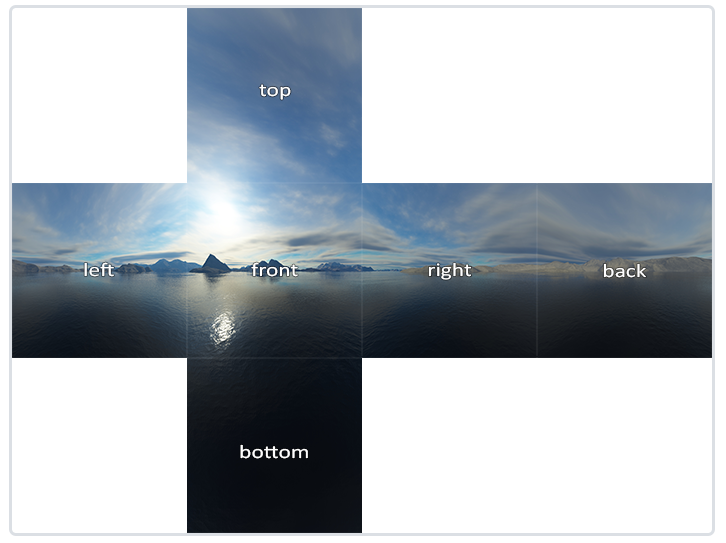
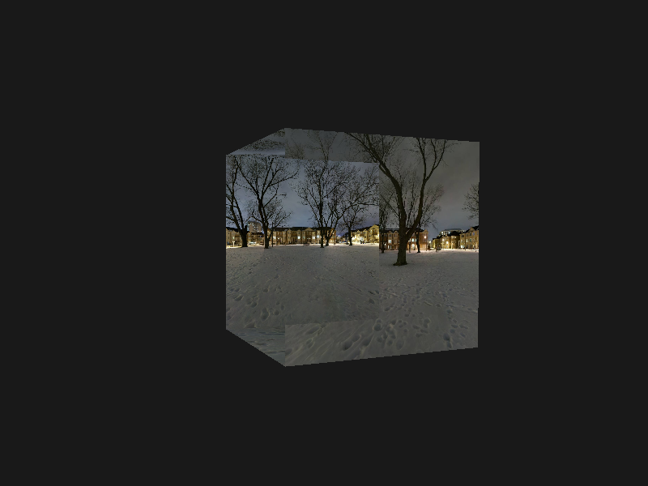
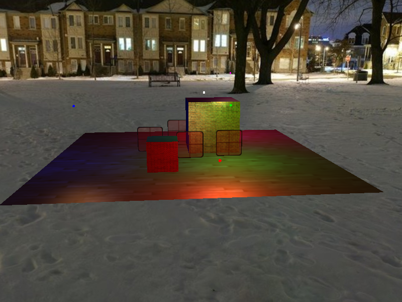
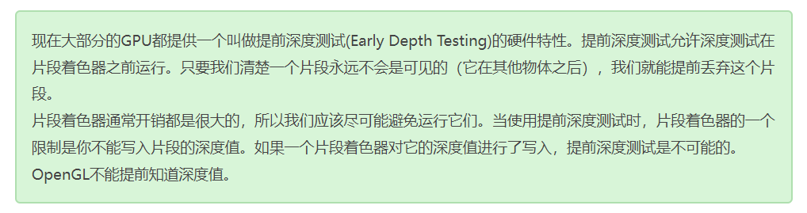
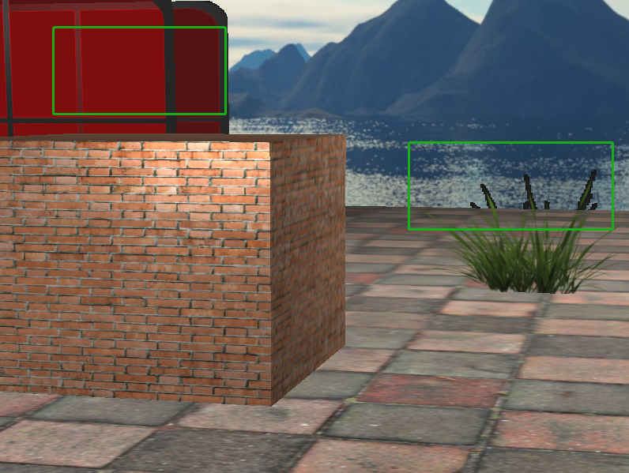

## 立方体贴图

### 天空盒

| 纹理目标                         | 方位 | 简称 |
| :------------------------------- | :--- | :--- |
| `GL_TEXTURE_CUBE_MAP_POSITIVE_X` | 右   | px   |
| `GL_TEXTURE_CUBE_MAP_NEGATIVE_X` | 左   | nx   |
| `GL_TEXTURE_CUBE_MAP_POSITIVE_Y` | 上   | py   |
| `GL_TEXTURE_CUBE_MAP_NEGATIVE_Y` | 下   | ny   |
| `GL_TEXTURE_CUBE_MAP_POSITIVE_Z` | 后   | pz   |
| `GL_TEXTURE_CUBE_MAP_NEGATIVE_Z` | 前   | nz   |

**可以看`BoxGeometry.h`的构造函数，生成面的顺序也是按从`positive`到`negative`，从`x`到`y`到`z`**



### 绘制天空盒

**vertex glsl**

```glsl
#version 330 core
layout(location = 0) in vec3 Position;
out vec3 outTexCoord;
uniform mat4 view;
uniform mat4 projection;

void main() {
	outTexCoord = Position;
	vec4 pos = projection * view * vec4(Position, 1.0);
	gl_Position = pos;
}
```

**fragment shader**

```glsl
#version 330 core
out vec4 FragColor;
in vec3 outTexCoord;

uniform samplerCube skyboxTexture;

void main() {
    FragColor = texture(skyboxTexture, outTexCoord);
}
```

```c++
// 绘制天空盒
glDepthFunc(GL_LEQUAL);
glDisable(GL_DEPTH_TEST);

skyboxShader.use();
skyboxShader.setMat4("view", view);
skyboxShader.setMat4("projection", projection);

glActiveTexture(GL_TEXTURE0);
glBindTexture(GL_TEXTURE_CUBE_MAP, cubemapTexture);
glBindVertexArray(skyboxGeometry.VAO);
glDrawElements(GL_TRIANGLES, skyboxGeometry.indices.size(), GL_UNSIGNED_INT, 0);

glBindVertexArray(0);
glDepthFunc(GL_LESS);
glEnable(GL_DEPTH_TEST);
```



### 移除平移

```c++
view = glm::mat4(glm::mat3(camera.GetViewMatrix())); // 移除平移分量

// 绘制其它物体时恢复
view = camera.GetViewMatrix();
```




### 优化

2024年8月29日

之前是把绘制天空盒放在循环的开头，然后才是渲染场景中其他物体。这样效率比较低，渲染天空盒就把屏幕的每一个像素都运行一遍片段着色器，即使最终只有一小部分天空盒能看到。

可以利用提前深度测试（Early Depth Testing）的特性来稍微提升下性能。



```cpp
void drawSkyBox(Shader shader, BoxGeometry geometry, unsigned int cubeMap)
{
	// 开启深度测试
    glEnable(GL_DEPTH_TEST);
	// 测试方法从 GL_LESS(小于) 调整到 GL_LEQUAL(小于等于)
	// 深度缓冲默认是1.0
	// 而绘制天空盒时会在 顶点着色器 上把box顶点的z值设置成等于w值，如此执行透视除法(x/w, y/w, z/w)后，顶点的z值就等于1.0了。
	// 如此只有小于等于1.0时天空盒的片段才通过深度测试，才会被绘制出来。
	// 那其实这里测试方法换成 GL_EQUAL(等于) 也是可行的。（试过后确实可行）
    glDepthFunc(GL_LEQUAL);

    shader.use();
    glm::mat4 view = glm::mat4(glm::mat3(camera.GetViewMatrix())); // 移除平移分量
    glm::mat4 projection = glm::perspective(glm::radians(camera.Zoom), (float)SCREEN_WIDTH / (float)SCREEN_HEIGHT, 0.1f, 100.0f);

    shader.setMat4("view", view);
    shader.setMat4("projection", projection);

    glActiveTexture(GL_TEXTURE0);
    glBindTexture(GL_TEXTURE_CUBE_MAP, cubeMap);
    glBindVertexArray(geometry.vao);
    glDrawElements(GL_TRIANGLES, geometry.indices.size(), GL_UNSIGNED_INT, 0);

    glBindVertexArray(0);
    glDepthFunc(GL_LESS);
}
```

**cube_map_vert.glsl**

```cpp
#version 330 core
layout(location = 0) in vec3 Position;

out vec3 outTexCoord;

uniform mat4 view;
uniform mat4 projection;

void main() {
	outTexCoord = Position;
	vec4 pos = projection * view * vec4(Position, 1.0);
	// 确保透视除法后，片段深度为最大值1.0
	gl_Position = pos.xyww;
}
```

总结：

-	不需要模型矩阵
-	LookAt矩阵忽略位移，前两条是为了保证天空盒位置及其中心点永不变
-	保证进入片段着色器后，任意点的深度值都为最大值1.0（天空盒可以被任意物体挡住）

## 参考

https://learnopengl-cn.github.io/04%20Advanced%20OpenGL/06%20Cubemaps/

<br>
<br>
<br>


-----

<br>
<br>
<br>

~~遗留一个问题：在做本章节的优化小节时，提到可以把skybox放在最后绘制而无需关闭深度测试，但发现有alpha的纹理，比如窗户没法透过看到天空，草贴图完全透明和完全不透明的边界，会和天空有奇怪的像素点等问题~~

这个问题上面的优化，就解决了。

**混合**章节说了，有透明纹理的物体都放在最后绘制。这个问题就是把天空盒放到了透明物体后面绘制，导致半透明窗户不透光，完全透明的片段边缘出现锯齿


