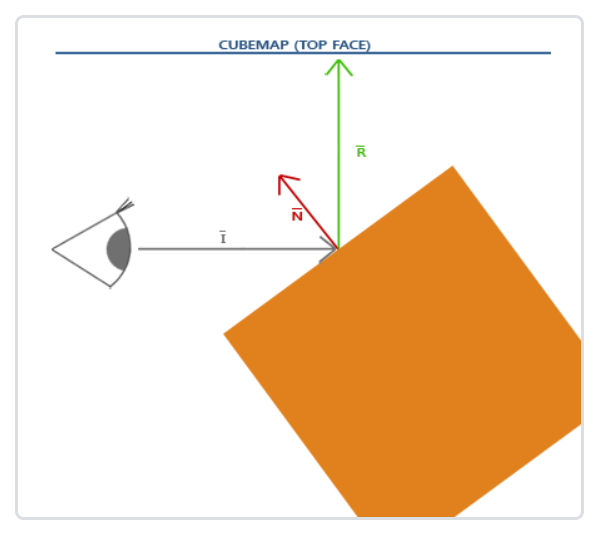
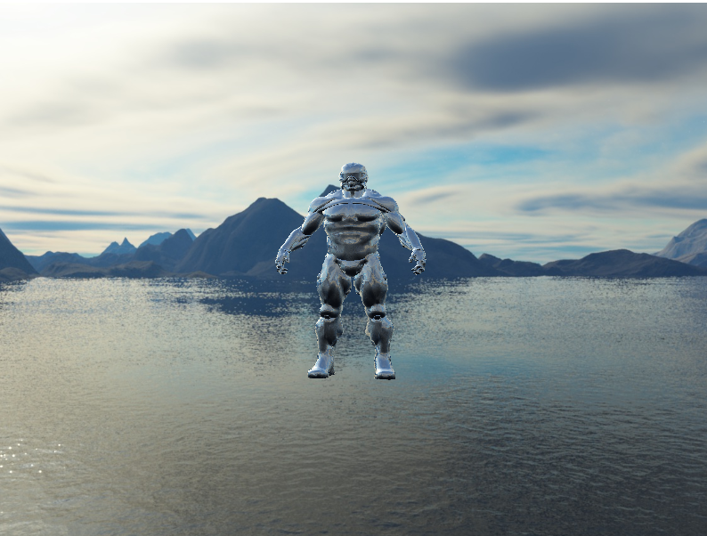
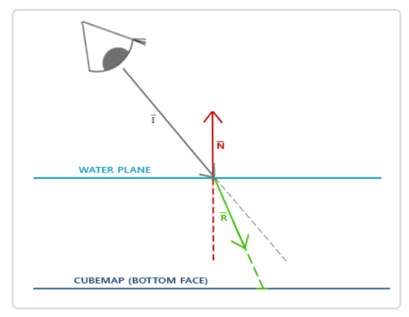
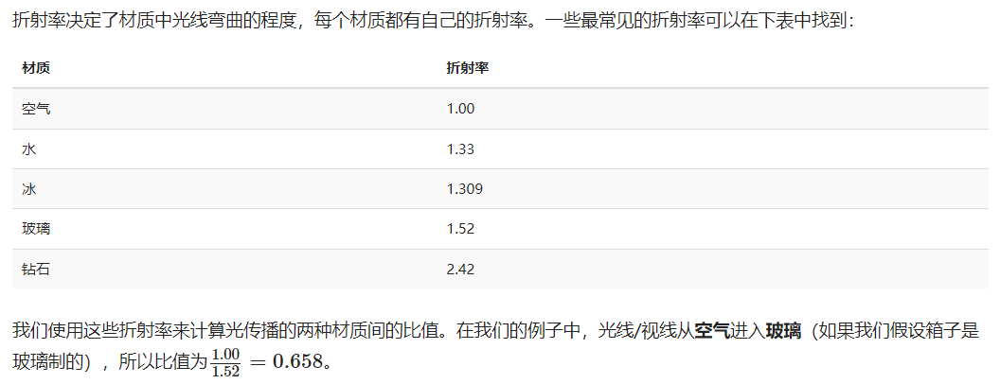
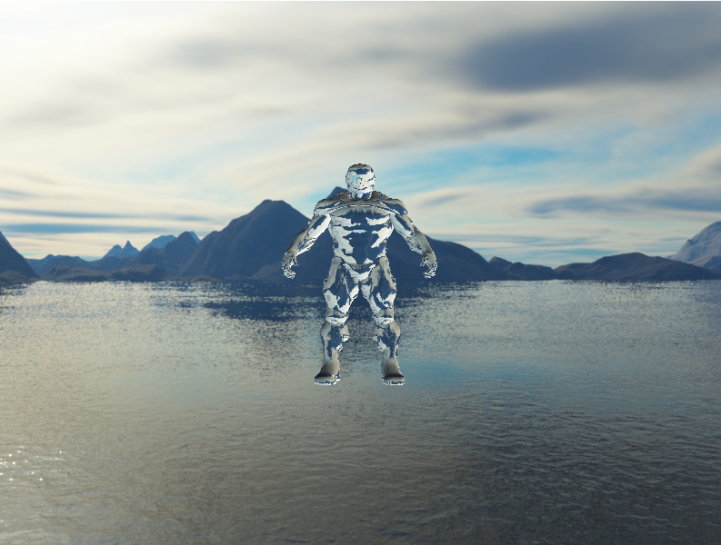

## 环境映射

天空盒是将整个环境映射到一个纹理对象上，然后贴到立方体，通过把view矩阵的位移去除，从而达到想要的效果。

而能利用这个纹理信息的不仅仅只有天空盒，还有场景中的物体。我们可以给物体反射和折射的属性，这样使用环境立方体贴图的技术叫环境映射`(Environment Mapping)`，其中最流行的两个就是反射`(Reflection)`和折射`(Refraction)`。


### 反射

计算出相机到片段的向量，即入射向量`I`，结合片段的法向量`N`，再调用接口`reflect(I, N)`即可得出反射向量`R`

再用`R`作为索引，采样立方体贴图，就能得出环境贴图在对应片段上的反射光颜色





```glsl
#version 330 core
layout(location = 0) in vec3 pos;
layout(location = 1) in vec3 norm;
layout(location = 2) in vec2 texCoords;

out vec3 Normal;
out vec3 Position;

uniform mat4 model = mat4(1.0);
uniform mat4 view;
uniform mat4 projection;

void main() {
    Normal = mat3(transpose(inverse(model))) * norm;
    Position = vec3(model * vec4(pos, 1.0));
    gl_Position = projection * view * vec4(Position, 1.0);
}
```

```glsl
#version 330 core
out vec4 FragColor;

in vec3 Normal;
in vec3 Position;
in vec2 tCoords;

uniform vec3 cameraPos;
uniform samplerCube skybox;

void main() {
    vec3 I = normalize(Position - cameraPos);
    vec3 R = reflect(I, normalize(Normal));   
    // 用R作为索引，采样立方体贴图
    FragColor = vec4(texture(skybox, R).rgb, 1.0);
}
```

<br>
<br>

### 折射

入射向量`I`，片段法向量`N`，折射向量`R`，还需要一个两材质之间的折射率`Refractive Index`。
折射率决定了材质中光线的弯曲程度。










```glsl
void main() {
    // 折射
    float ratio = 1.0 / 1.52;
    vec3 I = normalize(Position - cameraPos);
    vec3 R = refract(I, normalize(Normal), ratio);
    FragColor = vec4(texture(skybox, R).rgb, 1.0);
}
```