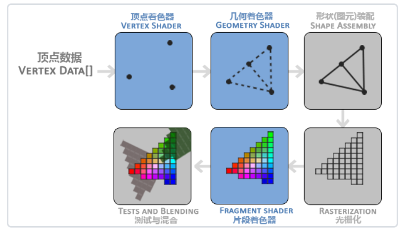
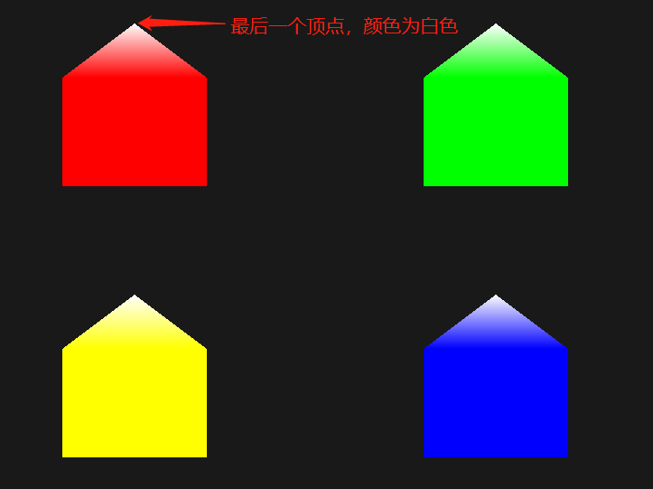

## 几何着色器

回顾一下渲染流程：



几何着色器可以将来自顶点着色器的顶点数据，进行任意变换，甚至可以将顶点变换为完全不同的`图元(shape)`，并生成更多顶点。

### 绘制多边形

**设置输入的图元类型**

```glsl
layout(points) in;
layout(line_strip, max_vertices = 2) out;
```

strip 条 带
adjacency 邻接

在`in`关键字前声明一个布局修饰符，表示从顶点着色器输入到几何着色器的图元类型。可以接收的图元类型有以下5种，括号内表示绘制该图元时所需最少顶点数。

-   points: 绘制`GL_POINTS`图元时（1）
-   lines: 绘制`GL_LINES`或`GL_LINE_STRIP`图元时（2）
-   lines_adjacency: GL_LINES_ADJACENCY或GL_LINE_STRIP_ADJACENCY（4）
-   triangles: GL_TRIANGLES、GL_TRIANGLE_STRIP或GL_TRIANGLE_FAN（3）
-   triangles_adjacency: GL_TRIANGLES_ADJACENCY或GL_TRIANGLE_STRIP_ADJACENCY（6）

而`out`关键字前面加一个布局修饰符，指定输出的图元类型，以及最大顶点数（顶点数量超出这个值也不会绘制**多出的**顶点）。输出的图元类型有以下3种。

-   points
-   line_strip
-   triangle_strip

GLSL提供了一个内建(built-in)变量，可以在几何着色器中使用`gl_in`

```glsl
in gl_Vertex
{
    vec4 gl_Position;
    float gl_PositionSize;
    float gl_ClipDistance[];
} gl_in[];
```

**例子：**

```glsl
#version 330 core
layout (points) in;
layout (line_strip, max_vertices = 2) out;

void main() {    
    gl_Position = gl_in[0].gl_Position + vec4(-0.1, 0.0, 0.0, 0.0); 
    EmitVertex();

    gl_Position = gl_in[0].gl_Position + vec4( 0.1, 0.0, 0.0, 0.0);
    EmitVertex();

    EndPrimitive();
}
```

geometry shader接收一个`points`，输出一个`line_strip`。

每接收一个顶点，分别向正负`x`方向偏移`0.1`，然后调用函数`EmitVertex()`，将顶点添加到图元中，最后调用`EndPrimitive()`，将发射出的`(Emitted)`的顶点合成指定的输出渲染图元。


<br>
<br>

**实例：**

**vertex shader**

```glsl
#version 330 core
layout(location = 0) in vec2 apos;
layout(location = 1) in vec3 acolor;

out VS_OUT {
    vec3 color;
} vs_out;

void main() {
    vs_out.color = acolor;
    gl_Position = vec4(apos, 0, 1.0);
}
```

**geometry shader**
```glsl
#version 330 core
layout(points) in;
layout(triangle_strip, max_vertices = 5) out;

in VS_OUT {
    vec3 color;
} gs_in[];

out vec3 fColor;

void build_house(vec4 position) {
    fColor = gs_in[0].color; // gs_in[0] since there's only one input vertex
    gl_Position = position + vec4(-0.2, -0.2, 0.0, 0.0); // 1:bottom-left   
    EmitVertex();
    gl_Position = position + vec4(0.2, -0.2, 0.0, 0.0); // 2:bottom-right
    EmitVertex();
    gl_Position = position + vec4(-0.2, 0.2, 0.0, 0.0); // 3:top-left
    EmitVertex();
    gl_Position = position + vec4(0.2, 0.2, 0.0, 0.0); // 4:top-right
    EmitVertex();
    gl_Position = position + vec4(0.0, 0.4, 0.0, 0.0); // 5:top
    
    // -------------------------最后一个顶点的颜色-------------------------
    fColor = vec3(1.0, 1.0, 1.0);

    EmitVertex();
    EndPrimitive();
}

void main() {
    build_house(gl_in[0].gl_Position);
}
```

**fragment shader**
```glsl
#version 330 core
out vec4 FragColor;

in vec3 fColor;

void main(){
    FragColor = vec4(fColor, 1.0);
}
```



<br>
<br>

### 爆破物体

使用叉乘`cross`获取垂直于平面的向量，即片段的法向量

```glsl
vec3 GetNormal()
{
    vec3 a = vec3(gl_in[0].gl_Position) - vec3(gl_in[1].gl_Position);
    vec3 b = vec3(gl_in[2].gl_Position) - vec3(gl_in[1].gl_Position);
    return normalize(cross(a, b));
}
```

使用位置向量沿着法向量进行平移
```glsl
vec4 explode(vec4 position, vec3 normal)
{
    float magnitude = 2.0;
    vec3 direction = normal * ((sin(time) + 1.0) / 2.0) * magnitude;
    return position + vec4(direction, 0.0);
}
```
