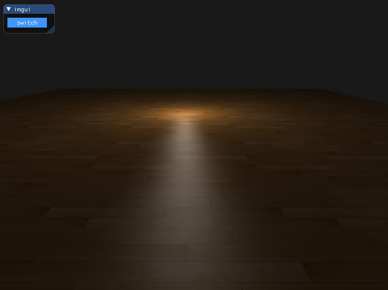
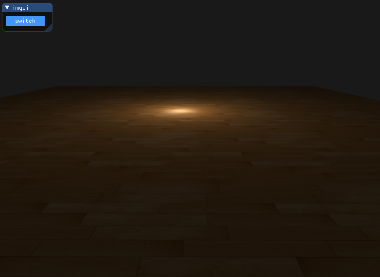

## Anti-Aliasing 抗锯齿

**锯齿**

aliasing是走样的意思，anti-aliasing就是反走样，也叫抗锯齿



## 抗锯齿技术

**超采样抗锯齿**，`Super Sample Anti-aliasing (SSAA)`，使用比正常分辨率更高的分辨率来渲染场景，即超采样，当图像输出到帧缓冲中更新时，分辨率会被下采样`(Downsample)`至正常分辨率，而额外的分辨率会被用来防止锯齿边缘的产生。

优点：完美解决走样问题

缺点：开销增大很多

（想起101课程里提到的`trade off`）

<br>

**多重采样抗锯齿**，`Multisample Anti-aliasing (MSAA)`，只要像素点上的子采样点被覆盖，但无论覆盖了多少子采样点，每个像素只运行**一次**片段着色器，而片段着色器所使用的顶点数据会插值到每个像素的**中心**，所得到的结果颜色会被存储在每个被覆盖的子采样点中，最后每个像素的颜色就是每个子采样点颜色的平均了。

**启用多重采样抗锯齿**

```c++
// 片段着色器将作用域每一个采样点（采用4倍抗锯齿，则每个像素有4个片段（四个采样点））
// 采样点越多越，但是缓冲会翻倍增加
glfwWindowHint(GLFW_SAMPLES, 4);

glEnable(GL_MULTISAMPLE);
```

