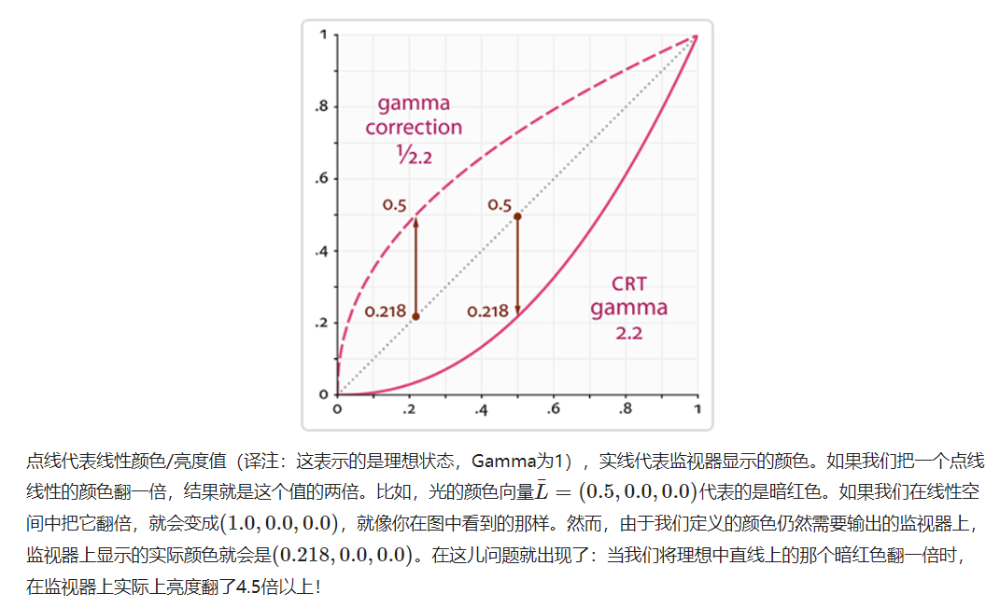
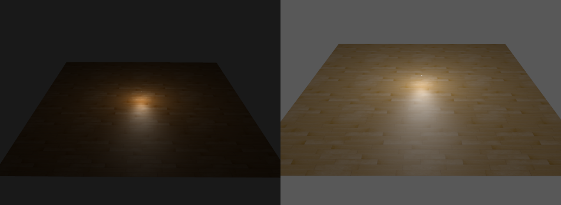
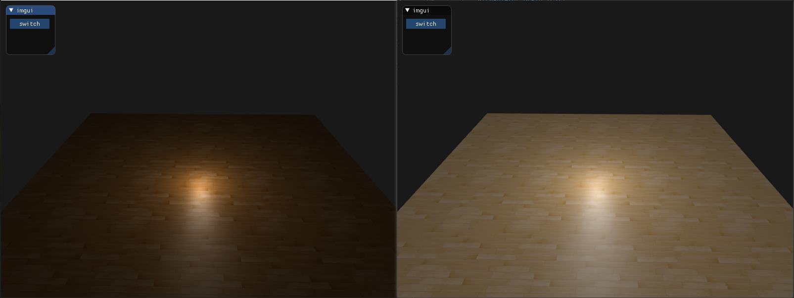
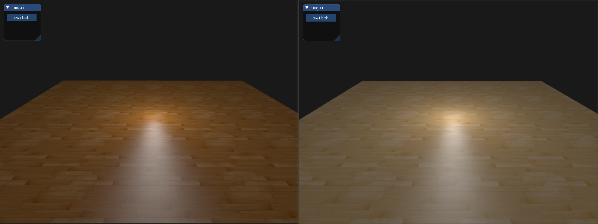
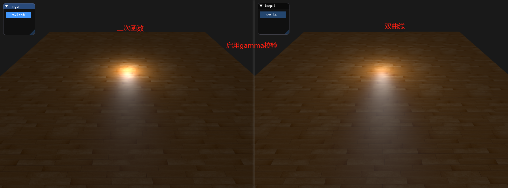

## Gamma correction

人对暗色的分辨能力远超亮色，那在有限的计算机颜色，黑色到白色 256 个色阶，暗色和亮色均匀分布的话，亮色部分会精度过剩而暗色部分会精度不足。进行 Gamma 校正可以解决这个问题。




计算出的颜色，再输出到监视器上，一般来说不会是一比一的输出，而是其`2.2`次幂

图中，当光的颜色为`(0.5, 0.0, 0.0)`时，在监视器中，各个颜色分量作2.2次幂运算，`(0.218, 0.0, 0.0)`，所得结果才是监视器显示的颜色。当我们把光的颜色翻倍，即`(1.0, 0.0, 0.0)`时，监视器显示的颜色也为`(1.0, 0.0, 0.0)`，而与上次监视器显示对比，亮度提高了`1 / 0.218 = 4.587`倍以上。

通常在做场景渲染，设置颜色、光照，我们都是在线性空间（Gamma = 1）中开发的，但输出到监视器（Gamma = 2.2）上，明显就变暗了，所以为了解决这个问题，可以把颜色设置得比原来亮一些（Gamma = 1/2.2）。

$0.5^{1/2.2} = 0.73$

$0.73^{2.2} = 0.5$

如此，在线性空间中开发的颜色光照，在监视器中也是线性显示。

另外，还要记住，监视器所显示出来的图像和线性图像的最小亮度是相同的，它们最大的亮度也是相同的；只是中间亮度部分会被压暗。

### 启用gamma校正

OpenGL中启用gamma校正的方法

```c++
// 怎么不管用啊
glEnable(GL_FRAMEBUFFER_SRGB);
```



不仅纹理变亮了，**背景也变白一些**


着色器中使用

```glsl
FragColor = vec4(result, 1.0);
float gamma = 2.2;
FragColor.rgb = pow(FragColor.rgb, vec3(1.0 / gamma));
```




### 纹理重校

使用gamma校正后会发现纹理颜色被破坏了，这是因为进行了两次gamma校正，所以图片显得很亮

把sRGB纹理变回线性空间

```glsl
float gamma = 2.2;
// 将颜色变回线性空间
vec3 color = pow(texture(woodMap, oTexCoord).rgb, vec3(gamma));

// 进行gamma校正
FragColor = vec4(result, 1.0);
FragColor.rgb = pow(FragColor.rgb, vec3(1.0 / gamma));
```



### 衰减

真实的物理世界中，光照的衰减`Attenuation`是和光源的距离的**平方**成反比（**二次函数**）的：

```glsl
float attenuation = 1.0 / (distance * distance);
```

而在使用gamma校正后，在监视器中的衰减方程也进行了2.2次幂的运算，也就是$(1.0 / distance^2)^{2.2}$，进一步增强了衰减效果。

但是吧，如果我们把衰减方程改成**双曲线**：

```glsl
float attenuation = 1.0 / distance;
```

在监视器作用2.2次幂后，就是$1.0 / distance^{2.2}$，与真实的物理世界衰减方程$1.0 / distance^{2}$很相似，渲染结果会更接近真实世界。

总的来说，如果启用了gamma校正，衰减方程采用双曲线；如果不启用，则采用二次函数。

