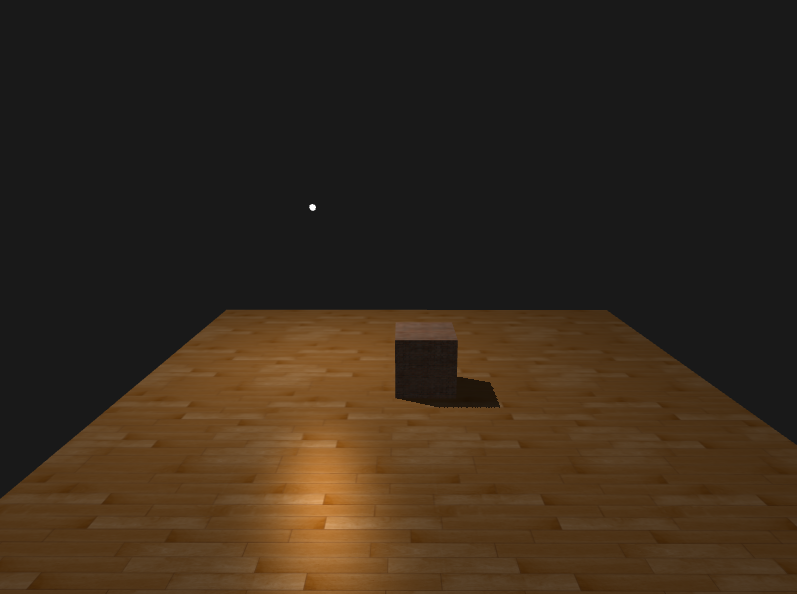
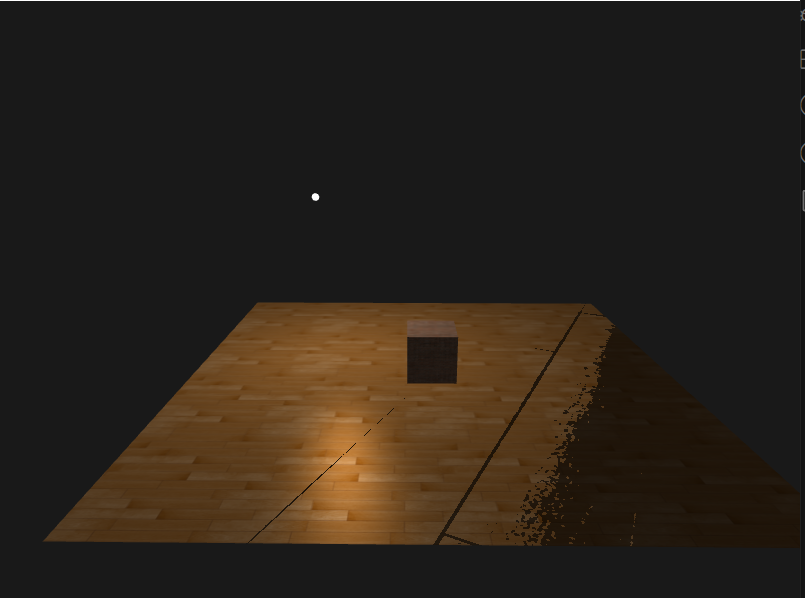
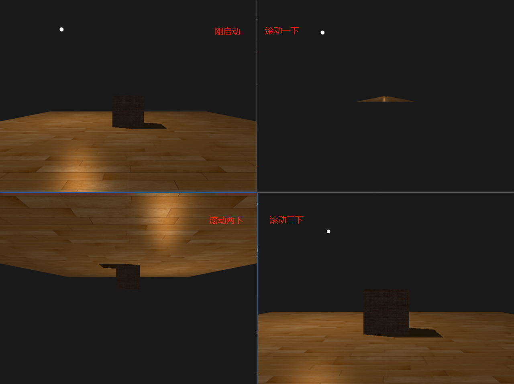

## 阴影映射

从光源的视角，进行深度测试，**看不见**的片段就是在阴影中。

阴影映射由两个步骤组成：渲染深度贴图。

**深度贴图**

生成深度贴图，将深度值存储在深度纹理中

**步骤1：**

创建帧缓冲

```c++
unsigned int depthMapFBO;
glGenFramebuffers(1, &depthMapFBO);
```

**步骤2：**

创建2D纹理，提供给帧缓冲中的深度缓冲使用

```c++
const GLuint SHADOW_WIDTH = 1024, SHADOW_HEIGHT = 1024;
GLuint depthMap;
glGenTextures(1, &depthMap);
glBindTexture(GL_TEXTURE_2D, depthMap);
// 因为只关心深度值而不关系颜色，因此把纹理格式指定为GL_DEPTH_COMPONENT，还要把纹理宽高设置为1024，这是深度贴图的分辨率
glTexImage2D(GL_TEXTURE_2D, 0, GL_DEPTH_COMPONENT, SHADOW_WIDTH, SHADOW_HEIGHT, 0, GL_DEPTH_COMPONENT, GL_FLOAT, NULL);
glTexParameteri(GL_TEXTURE_2D, GL_TEXTURE_MIN_FILTER, GL_NEAREST);
glTexParameteri(GL_TEXTURE_2D, GL_TEXTURE_MAG_FILTER, GL_NEAREST);
glTexParameteri(GL_TEXTURE_2D, GL_TEXTURE_WRAP_S, GL_REPEAT);
glTexParameteri(GL_TEXTURE_2D, GL_TEXTURE_WRAP_T, GL_REPEAT);
```

**步骤3：**

把生成的纹理作为帧缓冲的深度缓冲

```c++
// 把生成的纹理作为帧缓冲的深度缓冲
glBindFramebuffer(GL_FRAMEBUFFER, depthMapFBO);
glFramebufferTexture2D(GL_FRAMEBUFFER, GL_DEPTH_ATTACHMENT, GL_TEXTURE_2D, depthMap, 0);
// 因为只关心深度值而不关系颜色，但不包含颜色缓冲的帧缓冲是不完整的，因此需要显示explicitly告诉OpenGL不使用任何颜色数据进行渲染
glDrawBuffer(GL_NONE);
glReadBuffer(GL_NONE);
glBindFramebuffer(GL_FRAMEBUFFER, 0);
```

**步骤4：**

循环渲染中

```c++
// 1.渲染深度贴图

// 2.使用深度贴图
```

```c++
// 渲染深度贴图
// ++++++++++++++++++++++++++++++++++++++++++++++++++++++++++++++++
lightView = glm::lookAt(lightPosition, glm::vec3(0.0f), glm::vec3(0.0f, 1.0f, 0.0f));
lightSpaceMat = lightProjection * lightView;
shadowShader.use();
shadowShader.setMat4("lightSpaceMat", lightSpaceMat);
model = glm::rotate(glm::mat4(1.0f), glm::radians(-90.0f), glm::vec3(1, 0, 0));
shadowShader.setMat4("model", model);
glViewport(0, 0, SHADOW_WIDTH, SHADOW_HEIGHT);
glBindFramebuffer(GL_FRAMEBUFFER, depthMapFBO);
glClear(GL_DEPTH_BUFFER_BIT);
glActiveTexture(GL_TEXTURE0);
glBindTexture(GL_TEXTURE_2D, floorMap);
drawMesh(floor);
glBindTexture(GL_TEXTURE_2D, brickMap);
model = glm::translate(glm::mat4(1.0f), glm::vec3(0, 0.5, 0));
shadowShader.setMat4("model", model);
drawMesh(brick);
glBindFramebuffer(GL_FRAMEBUFFER, 0);
// ++++++++++++++++++++++++++++++++++++++++++++++++++++++++++++++++

glViewport(0, 0, SCREEN_WIDTH, SCREEN_HEIGHT);
glClear(GL_COLOR_BUFFER_BIT | GL_DEPTH_BUFFER_BIT);

view = camera.GetViewMatrix();
finalShadowShader.use();
finalShadowShader.setMat4("view", view);
finalShadowShader.setMat4("projection", projection);
finalShadowShader.setVec3("viewPos", camera.Position);
finalShadowShader.setMat4("lightSpaceMat", lightSpaceMat);
finalShadowShader.setVec3("lightPos", lightPosition);
finalShadowShader.setFloat("uvScale", 4.0f);

glActiveTexture(GL_TEXTURE0);
glBindTexture(GL_TEXTURE_2D, floorMap);
glActiveTexture(GL_TEXTURE1);
glBindTexture(GL_TEXTURE_2D, depthMap);

model = glm::rotate(glm::mat4(1.0f), glm::radians(-90.0f), glm::vec3(1, 0, 0));
finalShadowShader.setMat4("model", model);
drawMesh(floor);

glActiveTexture(GL_TEXTURE0);
glBindTexture(GL_TEXTURE_2D, brickMap);

model = glm::translate(glm::mat4(1.0f), glm::vec3(0, 0.5, 0));
finalShadowShader.setMat4("model", model);
finalShadowShader.setFloat("uvScale", 1.0);
drawMesh(brick);

drawLightObject(lightObjectShader, pointLightGeometry, lightPosition);
```



<br>
<br>

前面漏了这个：

```c++
finalShadowShader.use();
finalShadowShader.setInt("diffuseTexture", 0);
finalShadowShader.setInt("shadowMap", 1);
```

导致阴影很奇怪




**还有个很奇怪的问题：**滑动鼠标滚轮，发现只有光源的几何体会放大缩小，其余不会。

傻逼了。。忘了在循环中更新投影矩阵。。

但又出问题了



又傻逼了，循环中更新投影矩阵，参数传错了
```c++
// 第一个参数直接传来camera.Zoom，才导致上述的问题
projection = glm::perspective(glm::radians(camera.Zoom), (float)SCREEN_WIDTH / SCREEN_HEIGHT, 0.1f, 100.0f);
```