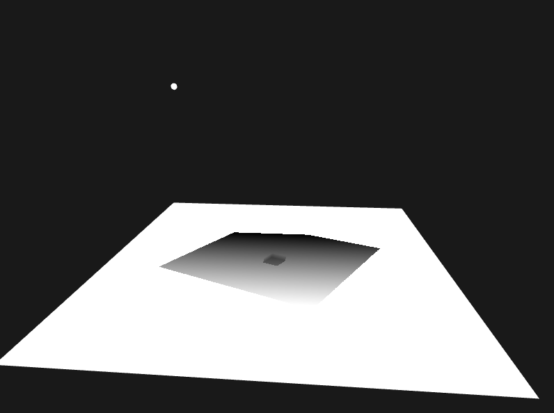
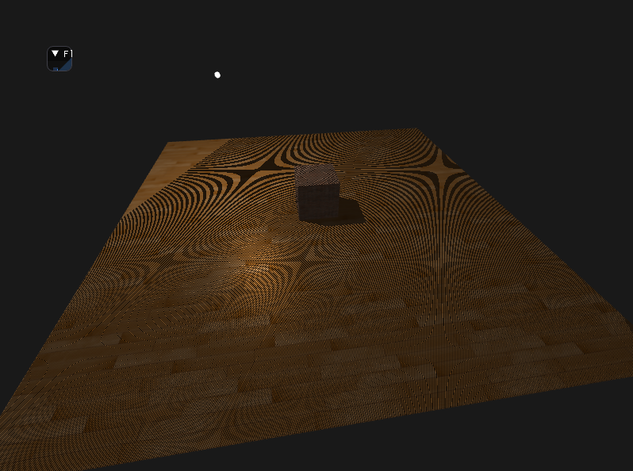
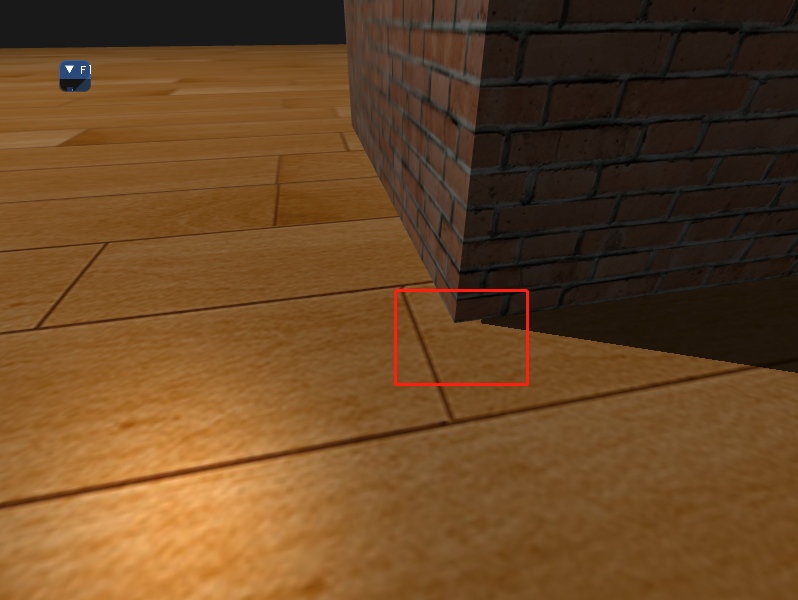
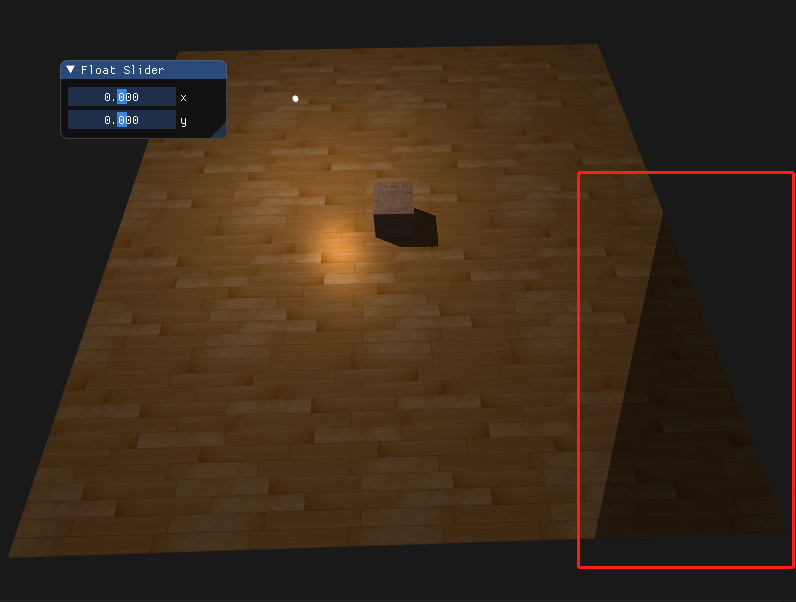
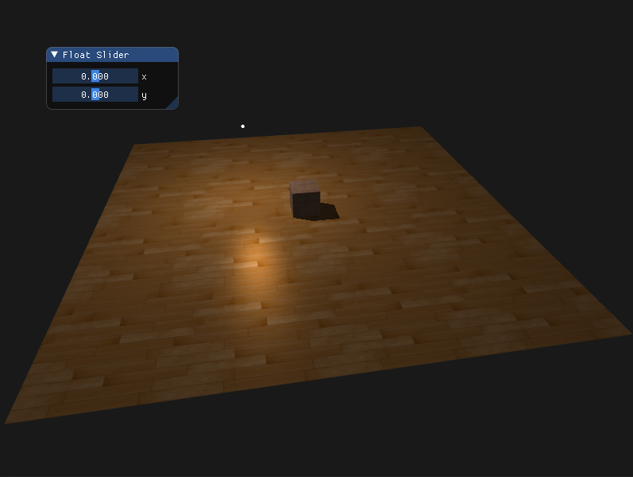

## 阴影映射

从光源的视角，进行深度测试，**看不见**的片段就是在阴影中。

阴影映射由两个步骤组成：渲染深度贴图。

**深度贴图**

生成深度贴图，将深度值存储在深度纹理中

**步骤1：**

创建帧缓冲

```c++
unsigned int depthMapFBO;
glGenFramebuffers(1, &depthMapFBO);
```

**步骤2：**

创建2D纹理，提供给帧缓冲中的深度缓冲使用

```c++
const GLuint SHADOW_WIDTH = 1024, SHADOW_HEIGHT = 1024;
GLuint depthMap;
glGenTextures(1, &depthMap);
glBindTexture(GL_TEXTURE_2D, depthMap);
// 因为只关心深度值而不关系颜色，因此把纹理格式指定为GL_DEPTH_COMPONENT，还要把纹理宽高设置为1024，这是深度贴图的分辨率
glTexImage2D(GL_TEXTURE_2D, 0, GL_DEPTH_COMPONENT, SHADOW_WIDTH, SHADOW_HEIGHT, 0, GL_DEPTH_COMPONENT, GL_FLOAT, NULL);
glTexParameteri(GL_TEXTURE_2D, GL_TEXTURE_MIN_FILTER, GL_NEAREST);
glTexParameteri(GL_TEXTURE_2D, GL_TEXTURE_MAG_FILTER, GL_NEAREST);
glTexParameteri(GL_TEXTURE_2D, GL_TEXTURE_WRAP_S, GL_REPEAT);
glTexParameteri(GL_TEXTURE_2D, GL_TEXTURE_WRAP_T, GL_REPEAT);
```

**步骤3：**

把生成的纹理作为帧缓冲的深度缓冲

```c++
// 把生成的纹理作为帧缓冲的深度缓冲
glBindFramebuffer(GL_FRAMEBUFFER, depthMapFBO);
glFramebufferTexture2D(GL_FRAMEBUFFER, GL_DEPTH_ATTACHMENT, GL_TEXTURE_2D, depthMap, 0);
// 因为只关心深度值而不关系颜色，但不包含颜色缓冲的帧缓冲是不完整的，因此需要显示explicitly告诉OpenGL不使用任何颜色数据进行渲染
glDrawBuffer(GL_NONE);
glReadBuffer(GL_NONE);
glBindFramebuffer(GL_FRAMEBUFFER, 0);
```

**步骤4：**

循环渲染中

```c++
// 1.渲染深度贴图

// 2.使用深度贴图
```

```c++
// 渲染深度贴图
// ++++++++++++++++++++++++++++++++++++++++++++++++++++++++++++++++
lightView = glm::lookAt(lightPosition, glm::vec3(0.0f), glm::vec3(0.0f, 1.0f, 0.0f));
lightSpaceMat = lightProjection * lightView;
shadowShader.use();
shadowShader.setMat4("lightSpaceMat", lightSpaceMat);
model = glm::rotate(glm::mat4(1.0f), glm::radians(-90.0f), glm::vec3(1, 0, 0));
shadowShader.setMat4("model", model);
glViewport(0, 0, SHADOW_WIDTH, SHADOW_HEIGHT);
glBindFramebuffer(GL_FRAMEBUFFER, depthMapFBO);
glClear(GL_DEPTH_BUFFER_BIT);
glActiveTexture(GL_TEXTURE0);
glBindTexture(GL_TEXTURE_2D, floorMap);
drawMesh(floor);
glBindTexture(GL_TEXTURE_2D, brickMap);
model = glm::translate(glm::mat4(1.0f), glm::vec3(0, 0.5, 0));
shadowShader.setMat4("model", model);
drawMesh(brick);
glBindFramebuffer(GL_FRAMEBUFFER, 0);
// ++++++++++++++++++++++++++++++++++++++++++++++++++++++++++++++++

glViewport(0, 0, SCREEN_WIDTH, SCREEN_HEIGHT);
glClear(GL_COLOR_BUFFER_BIT | GL_DEPTH_BUFFER_BIT);

view = camera.GetViewMatrix();

// main1.cpp
// 显示深度贴图
// *************************************************
quadShader.use();
glActiveTexture(GL_TEXTURE0);
glBindTexture(GL_TEXTURE_2D, depthMap);
quadShader.setMat4("view", view);

// model = glm::mat4(1.0f);
model = glm::rotate(glm::mat4(1.0f), glm::radians(-90.0f), glm::vec3(1, 0, 0));
quadShader.setFloat("near_plane", near_plane);
quadShader.setFloat("far_plane", far_plane);
quadShader.setMat4("model", model);
quadShader.setMat4("projection", projection);
drawMesh(quadGeometry);
// *************************************************
```




渲染阴影贴图

```c++
// 渲染阴影贴图
// *************************************************
finalShadowShader.use();
finalShadowShader.setMat4("view", view);
finalShadowShader.setMat4("projection", projection);
finalShadowShader.setVec3("viewPos", camera.Position);
finalShadowShader.setMat4("lightSpaceMat", lightSpaceMat);
finalShadowShader.setVec3("lightPos", lightPosition);
finalShadowShader.setFloat("uvScale", 4.0f);

glActiveTexture(GL_TEXTURE0);
glBindTexture(GL_TEXTURE_2D, floorMap);
glActiveTexture(GL_TEXTURE1);
glBindTexture(GL_TEXTURE_2D, depthMap);

model = glm::rotate(glm::mat4(1.0f), glm::radians(-90.0f), glm::vec3(1, 0, 0));
finalShadowShader.setMat4("model", model);
drawMesh(floor);

glActiveTexture(GL_TEXTURE0);
glBindTexture(GL_TEXTURE_2D, brickMap);

model = glm::translate(glm::mat4(1.0f), glm::vec3(0, 0.5, 0));
finalShadowShader.setMat4("model", model);
finalShadowShader.setFloat("uvScale", 1.0);
drawMesh(brick);

drawLightObject(lightObjectShader, pointLightGeometry, lightPosition);
// *************************************************
```


<br>
<br>

前面漏了这个：

```c++
finalShadowShader.use();
finalShadowShader.setInt("diffuseTexture", 0);
finalShadowShader.setInt("shadowMap", 1);
```

导致阴影很奇怪


还有个很奇怪的问题：滑动鼠标滚轮，发现只有光源的几何体会放大缩小，其余不会。

傻逼了。。忘了在循环中更新投影矩阵。。

但又出问题了


又傻逼了，循环中更新投影矩阵，参数传错了
```c++
// 第一个参数直接传来camera.Zoom，才导致上述的问题
projection = glm::perspective(glm::radians(camera.Zoom), (float)SCREEN_WIDTH / SCREEN_HEIGHT, 0.1f, 100.0f);
```

### 阴影失真


前面直接抄写好的片段着色器，比看到教程中多了一个判断，**失真**效果没显示出来

`shadow_final_frag.glsl`

```glsl
// 检查当前片段是否在阴影中
// float shadow = currentDepth - bias > closestDepth ? 1.0 : 0.0;
float shadow = currentDepth > closestDepth ? 1.0 : 0.0;
```



非阴影区域有交替黑线出现，这叫做阴影失真(Shadow Acne)


因为阴影贴图受限于分辨率，在距离光源比较远的情况下，多个片段可能从深度贴图的同一个值中去采样，图片每个斜坡代表深度贴图一个单独的纹理像素，可以看到，多个片段从同一个深度值进行采样，当光源以一个角度朝向表面的时候会重修按问题，这种情况下深度贴图也是从一个角度下进行渲染，多个片段就会从同一个斜坡的深度纹理像素中采样，有些在地面上面，有些在地板下面，所以得到的阴影就会有差异。

因为有些片段被认为是在阴影之中，有些不在，因此产生了条纹样式。可以通过 **阴影偏移**的技巧来解决这个问题，可以简单的对表面的深度（或者深度贴图）应用一个偏移量，这样片段就不会被错误的认为在表面之下了。

```glsl
float bias = max(0.05 * (1.0 - dot(normal, lightDir)), 0.005);
float shadow = currentDepth - bias > closestDepth  ? 1.0 : 0.0;
```

失真的问题可以看看[这个解释](https://www.zhihu.com/question/49090321/answer/114217482)

### 悬浮



使用阴影偏移一个缺点是悬浮，如果值很大则会出现阴影相对与实际位置的偏移，使物体看起来轻轻悬浮在表面之上


解决方法：渲染深度贴图时，剔除正面

但面剔除和bias不能同时使用

### 采样过多



光的视锥不可见区域一律被认为时处于阴影之中，不过它真的处于阴影之中，出现这个原因是因为超过光的视锥的投影坐标比1.0大，这样深度纹理就会超出它默认的0到1的范围。

**解决办法**

将深度贴图的环绕方式设置为`GL_CLAMP_TO_BORDER`,然后给一个边框颜色，让超过的部分都显示同一个颜色

```c++
glTexParameteri(GL_TEXTURE_2D, GL_TEXTURE_WRAP_S, GL_CLAMP_TO_BORDER);
glTexParameteri(GL_TEXTURE_2D, GL_TEXTURE_WRAP_T, GL_CLAMP_TO_BORDER);
GLfloat borderColor[] = { 1.0, 1.0, 1.0, 1.0 };
glTexParameterfv(GL_TEXTURE_2D, GL_TEXTURE_BORDER_COLOR, borderColor);
```

当一个点比光的远平面还要远时，它的投影坐标的z坐标大于1.0，那么此时`GL_CLAMP_TO_BORDER`环绕方式不起作用，因为我们把坐标的z元素和深度贴图的值进行了对比，大于1时返回true，可以手动去强制将其设置为0，那么此是超过的边缘就会是border 的颜色。

```glsl
if(projCoords.z > 1.0) {
    shadow = 0.0;
}
```



<br>
<br>

### PCF柔和阴影

深度贴图有一个固定的分辨率，多个片段对应于一个纹理像素，结果就是多个片段会从深度贴图的同一个深度值进行采样，这几个片段便得到的是同一个阴影，因此会产生锯齿边。

- 增加深度贴图分辨率

- PCF - percentage closer filtering

  核心思想是从深度贴图中多次采样，每一次采样的纹理坐标都稍有不同，每个独立样本可能在或不在阴影中，将所有结果平均化得到柔和阴影

```glsl
// PCF
float shadow = 0.0;
vec2 texSize = 1.0 / textureSize(shadowMap, 0);
for(int i = -1; i <= 1; i++) {
    for(int j = -1; j <= 1; j++) {
        float pcfDepth = texture(shadowMap, projCoords.xy + vec2(i, j) * texSize).r;
        shadow += currentDepth - bias > pcfDepth ? 1.0 : 0.0;
    }
}
shadow /= 9.0;
```
