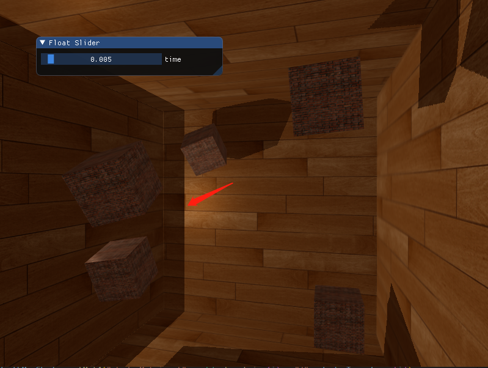
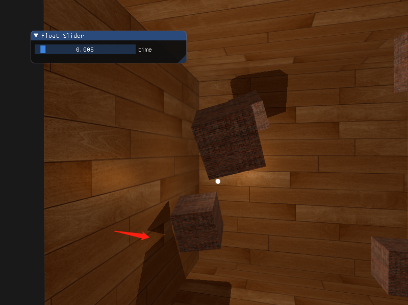
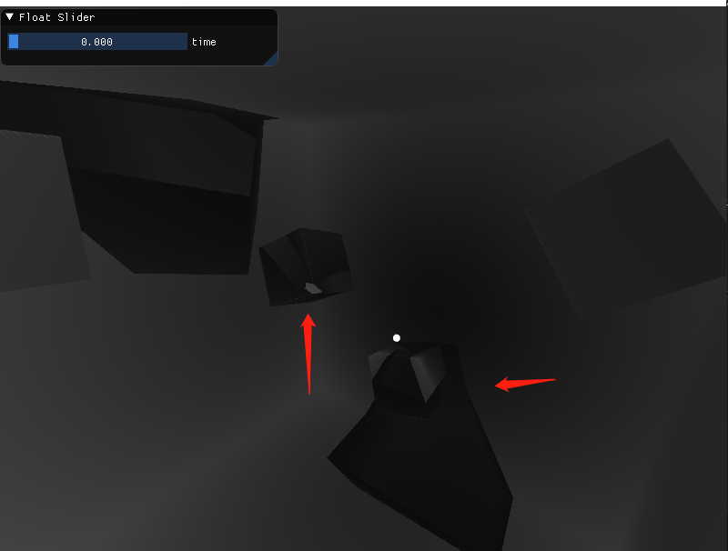
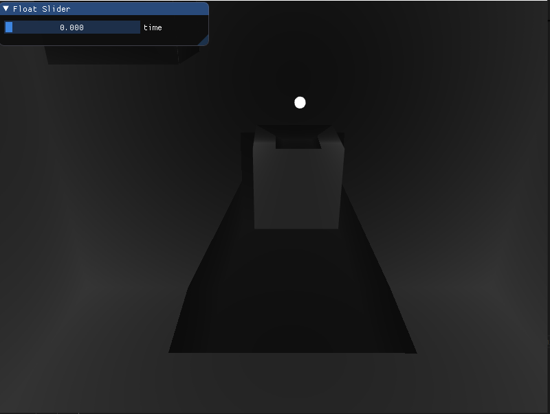

## 点光源阴影

上一节的阴影贴图，用到的技术是深度测试，在定向光源的视角下，渲染场景，获取深度信息。因为这是单一定向光源下生成的，因此也叫定向阴影映射。

点光源生成阴影的技术叫电光阴影，之前也叫万象阴影贴图(omnidirectional shadow maps)技术。
算法上和定向阴影映射差不多：从光的透视视图生成深度贴图，基于当前fragment位置对深度贴图采样，然后用存储的深度值和每个fragment进行对比，看是否处在阴影中。

二者主要不同在于深度贴图的使用上。


### 显示立方体贴图的深度缓冲





这阴影明显有问题，把深度缓冲显示出来看看。一个简单的把深度缓冲显示出来的技巧是，在ShadowCalculation函数中计算标准化的`closestDepth`变量，把变量显示为：

```glsl
FragColor = vec4(vec3(closestDepth / far_plane), 1.0);
```




把场景中箱子的旋转去掉后，还是有明显的不对




还发现一个不对的地方：光源过了箱子垂直面，阴影前后变化太大了。

