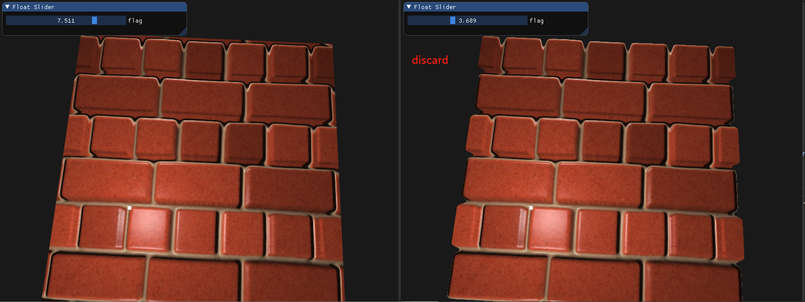
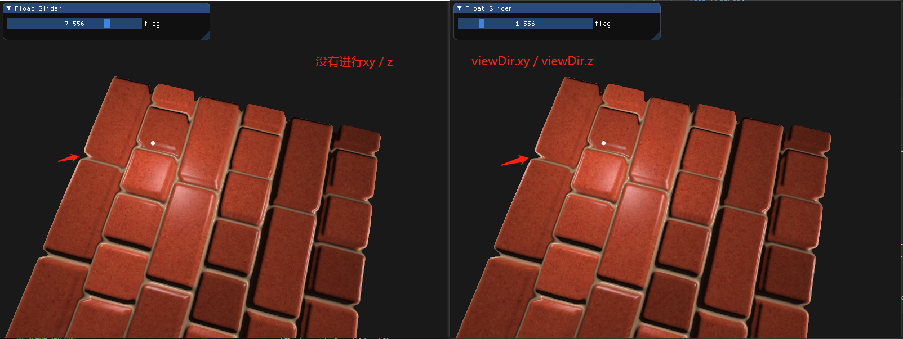
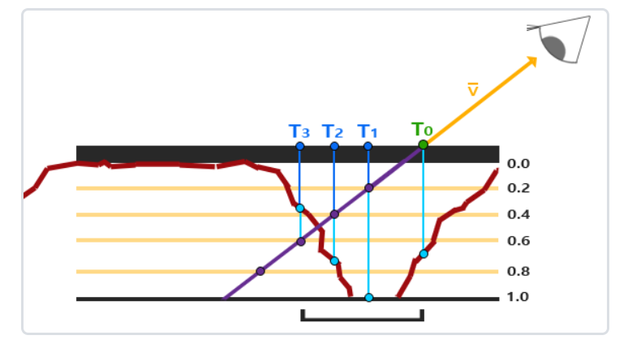
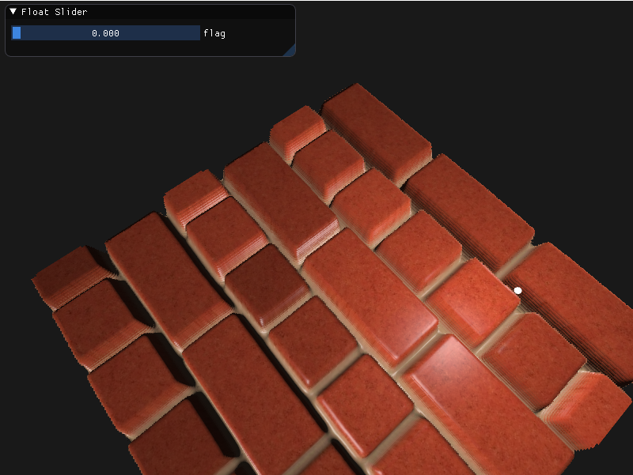
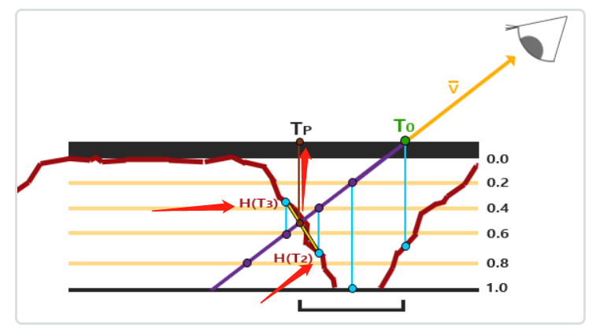
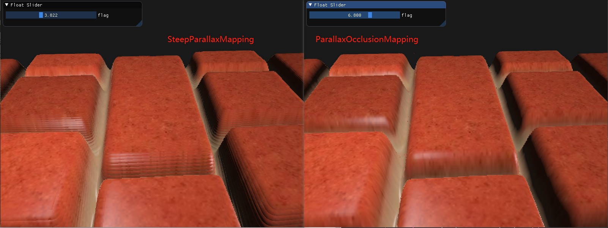

## 视差贴图

### 视差贴图 Parallax Mapping

**scene_frag.glsl**

```c++
// 注：viewDir是切线空间的向量
vec2 ParallaxMapping(vec2 texCoords, vec3 viewDir) {
    float height = texture(depthMap, texCoords).r;
    if(flag < 5.0) {
        p = viewDir.xy / viewDir.z * (height * height_scale);
    } else {
        p = (viewDir * height * height_scale).xy;
    }
    // vec2 p = viewDir.xy / viewDir.z * (height * height_scale);
    return texCoords - p;
}
```

去除边缘重复

```c++
void main()
{
    vec3 viewDir = normalize(fs_in.TangentViewPos - fs_in.TangentFragPos);
    vec2 texCoords = ParallaxMapping(fs_in.TexCoords, viewDir);

    // 丢弃失真片段
    // 纹理坐标超出范围
    if(texCoords.x > 1.0 || texCoords.x < 0.0 || texCoords.y > 1.0 || texCoords.y < 0.0) {
        discard;
    }

}
```



在`ParallaxMapping`函数中，`viewDir.xy / viewDir.z`的意义




<br>
<br>

### 陡峭视差映射 Steep Parallax Mapping

在陡峭的高度变化的情况下，它也能得到更好的结果，原因在于该技术通过增加采样的数量提高了精确性。

算法：通过分层增加采样数量，找到高度贴图对应高度小于当前层级高度的纹理坐标



**scene_frag.glsl**

```c++
vec2 SteepParallaxMapping(vec2 texCoords, vec3 viewDir) {
    const float minLayers = 8;
    const float maxLayers = 32;

    // number of depth layers
    float numLayers = mix(maxLayers, minLayers, abs(dot(vec3(0.0,0.0,1.0), viewDir)));
    // calculate the size of each layer
    float layerDepth = 1.0 / numLayers;
    // depth of current layer
    float currentLayerDepth = 0.0;
    // the amount to shift the texture corrdinates per layer from vector P
    vec2 p = viewDir.xy * height_scale;
    vec2 deltaTexCoords = p / numLayers;

    vec2 currentTexCoords = texCoords;
    float currentDepthMapValue = texture(depthMap, currentTexCoords).r;
    while(currentLayerDepth < currentDepthMapValue)
    {
        currentTexCoords -= deltaTexCoords;
        currentDepthMapValue = texture(depthMap, currentTexCoords).r;
        currentLayerDepth += layerDepth;
    }
    return currentTexCoords;
}
```



<br>

### 视差映射遮蔽 Parallax Occlusion Mapping

陡峭视差映射有明显的锯齿效果及图层之间的断层。

视差遮蔽映射(Parallax Occlusion Mapping)和陡峭视差映射的原则相同，但不是用触碰的第一个深度层的纹理坐标，而是在触碰之前和之后，在深度层之间进行线性插值。



```c++
vec2 ParallaxOcclusionMapping(vec2 texCoords, vec3 viewDir) {
    const float minLayers = 8;
    const float maxLayers = 32;

    // number of depth layers
    float numLayers = mix(maxLayers, minLayers, abs(dot(vec3(0.0, 0.0, 1.0), viewDir)));

    // calculate the size of each layer
    float layerDepth = 1.0 / numLayers;
    // depth of current layer
    float currentLayerDepth = 0.0;
    // the amount to shift the texture corrdinates per layer from vector P
    vec2 p = viewDir.xy * height_scale;
    vec2 deltaTexCoords = p / numLayers;

    vec2 currentTexCoords = texCoords;
    float currentDepthMapValue = texture(depthMap, currentTexCoords).r;
    while(currentLayerDepth < currentDepthMapValue) {
        currentTexCoords -= deltaTexCoords;
        currentDepthMapValue = texture(depthMap, currentTexCoords).r;
        currentLayerDepth += layerDepth;
    }

    // get texture coordinates before collision (reverse operations)
    vec2 preTexCoords = currentTexCoords + deltaTexCoords;

    // 碰撞后的深度差 H(T3)   currentLayerDepth > currentDepthMapValue
    float afterDepth = currentLayerDepth - currentDepthMapValue;
    // 碰撞前的深度差 H(T2)   texture(depthMap, preTexCoords).r > currentLayerDepth - layerDepth (上一层深度)
    float beforeDepth = texture(depthMap, preTexCoords).r - (currentLayerDepth - layerDepth);

    // 当afterDepth趋于0，则weight趋于0；当beforeDepth趋于0，则weight趋于1
    float weight = afterDepth / (afterDepth + beforeDepth);
    // interpolation 插值 of texture coordinates
    vec2 finalTexCoords = preTexCoords * weight + currentTexCoords * (1.0 - weight);
    return finalTexCoords;
}
```

