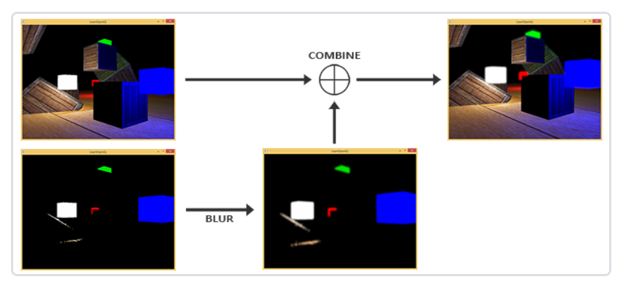
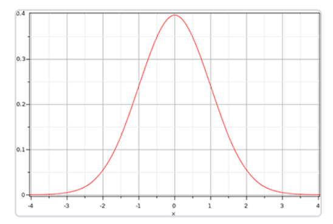
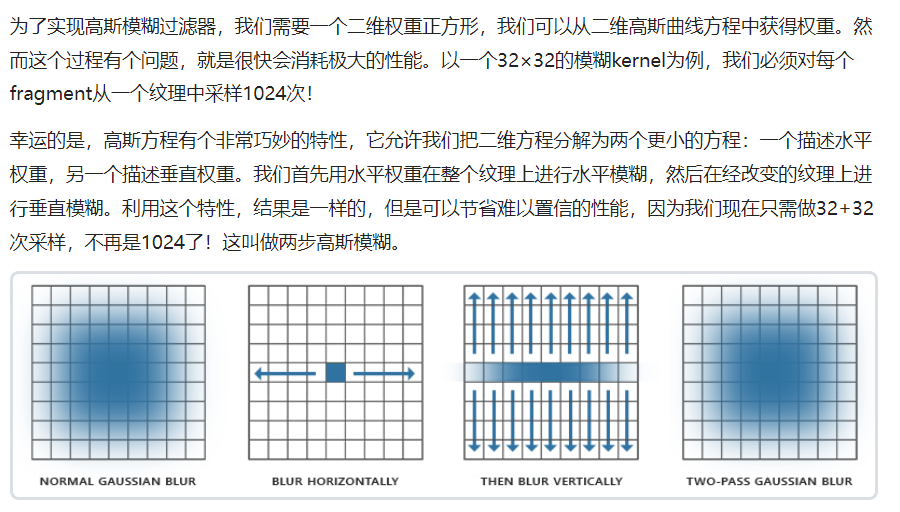

## 泛光 bloom

实现思路：

1. 提取场景光亮纹理1
2. 高斯模糊处理
3. 使用纹理1

由于模糊滤镜的作用，明亮的区域在宽度和高度上都得到了扩展，因此场景中的明亮区域看起来会发光或流光。



### 提取亮色

根据上图，我们要从渲染的场景中提取两张图片。可以通过渲染两次，也可以使用`MRT(Multiple Render Targets，多渲染目标)`的技巧，**指定片段着色器输出多个信息**。

**通过布局location标识符，控制片段着色器的输出对应到指定颜色缓冲中。**

```glsl
layout (location = 0) out vec4 FragColor;
layout (location = 1) out vec4 BrightColor;
```

当然，这里也只有当真的有多个可写入的缓冲区时才工作。

绑定多个颜色缓冲到当前的帧缓冲中：

```cpp
unsigned int hdrFBO;
glGenFramebuffers(1, &hdrFBO);

unsigned int colorBuffers[2];
glGenTextures(2, colorBuffers);
for (int i = 0; i < 2; ++i)
{
    glBindTexture(GL_TEXTURE_2D, colorBuffers[i]);
    glTexImage2D(GL_TEXTURE_2D, 0, GL_RGBA16F, SCREEN_WIDTH, SCREEN_HEIGHT, 0, GL_RGB, GL_FLOAT, NULL);
    glTexParameteri(GL_TEXTURE_2D, GL_TEXTURE_MIN_FILTER, GL_LINEAR);
    glTexParameteri(GL_TEXTURE_2D, GL_TEXTURE_MAG_FILTER, GL_LINEAR);
    glTexParameteri(GL_TEXTURE_2D, GL_TEXTURE_WRAP_S, GL_CLAMP_TO_EDGE);
    glTexParameteri(GL_TEXTURE_2D, GL_TEXTURE_WRAP_T, GL_CLAMP_TO_EDGE);
    // attach texture to framebuffer
    glFramebufferTexture2D(GL_FRAMEBUFFER, GL_COLOR_ATTACHMENT0 + i, GL_TEXTURE_2D, colorBuffers[i], 0);
}
glBindTexture(GL_TEXTURE_2D, 0);

// 显式告诉OpenGL我们正通过glDrawBuffers渲染到多个颜色缓冲中，否则OpenGL只会渲染到帧缓冲中的第一个颜色附件
unsigned int attachments[2] = {GL_COLOR_ATTACHMENT0, GL_COLOR_ATTACHMENT1};
glDrawBuffers(2, attachments);
```

**frag.glsl**

片段着色器中，先正常计算出`FragColor`值，然后通过转换为灰度计算片段的亮度来判断该颜色是否是我们需要的**光亮的片段**，

通过取两个向量的点积，我们有效地将两个向量的每个单独分量相乘并将结果加在一起，如果超过某个阈值，则输出到第二个颜色缓冲区。

```glsl
#version 330 core
layout(location = 0) out vec4 FragColor;
layout(location = 1) out vec4 BrightColor;
out vec4 FragColor;
in vec2 outTexCoord;

uniform sampler2D hdrBuffer;
uniform float exposure;
uniform bool hdr;

void main() {
    const float gamma = 2.2;
    vec3 hdrColor = texture(hdrBuffer, outTexCoord).rgb;

    // reinhard
    // vec3 result = hdrColor / (hdrColor + vec3(1.0));
    // exposure
    vec3 result = vec3(1.0) - exp(-hdrColor * exposure);
    // also gamma correct while we're at it       
    result = pow(result, vec3(1.0 / gamma));
    FragColor = vec4(result, 1.0);

    // Check whether fragment output is higher than threshold, if so output as brightness color
    // 检查片段输出是否高于阈值
    float brightColor = dot(FragColor.rgb, vec3(0.2126, 0.7152, 0.0722));
    if(brightColor > 1.0) {
        BrightColor = vec4(FragColor.rgb, 1.0);
    }
}
```

### 高斯模糊

高斯曲线在它的中间处的面积最大，使用它的值作为权重使得近处的样本拥有最大的优先权。比如，如果我们从fragment的32×32的四方形区域采样，这个权重随着和fragment的距离变大逐渐减小；通常这会得到更好更真实的模糊效果，这种模糊叫做高斯模糊。



实现高斯模糊过滤器，我们需要一个二维权重正方形。

-   水平权重
-   垂直权重

允许先进行水平模糊，后进行垂直模糊，每个片段就需要进行`32+32=64`次采样。这叫做**两步高斯模糊**。



**blur_scene_frag.glsl**

```glsl
#version 330 core
out vec4 FragColor;
in vec2 TexCoords;

uniform sampler2D image;

uniform bool horizontal;

uniform float weight[5] = float[] (0.227027, 0.1945946, 0.1216216, 0.054054, 0.016216);

void main(){
    // 计算单个像素的大小
    vec2 tex_offset = 1.0 / textureSize(image, 0);
    vec3 result = texture(image, TexCoords).rgb * weight[0];

    if(horizontal)
    {
        for(int i=1; i<5; ++i)
        {
            result += textrue(image, TexCoords + vec2(tex_offset.x * i, 0.0)).rgb * weight[i];
            result += textrue(image, TexCoords - vec2(tex_offset.x * i, 0.0)).rgb * weight[i];
        }
    }
    else
    {
        for(int i=1; i<5; ++i)
        {
            result += textrue(image, TexCoords + vec2(0.0, tex_offset.y * i)).rgb * weight[i];
            result += textrue(image, TexCoords - vec2(0.0, tex_offset.y * i)).rgb * weight[i];
        }
    }

    FragColor = vec4(result, 1.0);
    
}
```