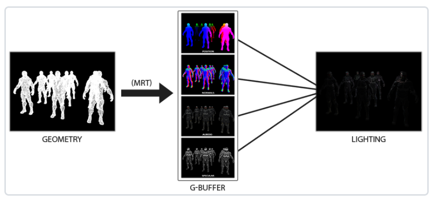

# deferred shading

延迟着色


前面的教程使用的光照方法叫**正向渲染(Forward Rendering)**或**正向着色法(Forward Shading)**。

优点：容易理解，容易实现。

缺点：需要渲染每一个物体，消耗大；而且后渲染的片段大部分会覆盖前渲染的片段，导致性能浪费。

在有大量光源的场景中，程序使用正向着色，就几乎不可能保持一个好的帧率。

----

延迟着色法基于延迟(defer)大部分计算量非常大的渲染（光照）到后期进行处理的想法。包含两个阶段：

### 几何处理阶段（geometry pass）

先渲染一边，获取各种几何信息，并存储在一系列叫G缓冲（G-buffer）的**纹理**中。一般参与到光照计算的几何信息，都可以填充到G缓冲中待用，例如位置向量(Position Vector)、颜色向量(Color Vector)、法向量(Normal Vector)和/或镜面值(Specular Value)。

### 光照处理阶段（Lighting pass）

使用G缓冲中的数据计算，而不是依赖顶点着色器的输出和一些uniform变量。




<br>
<br>

**优点**

延迟着色最大的一个好处是能保证G缓冲中的片段和在屏幕上呈现的像素所包含的片段信息是一致的，因为深度测试已经将这里的片段信息作为最顶层片段。也就是说，G缓冲中的片段是深度测试过的片段，已经丢弃掉场景中不可见也不需要渲染的片段。

**缺点**

G缓冲的颜色纹理缓冲中会存储大量的场景数据，会消耗很大的显存。

不支持混色，因为只有最前面的片段，也就无法使用MSAA。


**延迟渲染结合正向渲染**

需要将`gBuffer`的深度缓冲复制到默认缓冲中，否则会出现后面绘制的物体无法显示或者深度信息不正确的问题

```c++
// 延迟结合正向渲染
glBindFramebuffer(GL_READ_FRAMEBUFFER, gBuffer);
glBindFramebuffer(GL_DRAW_FRAMEBUFFER, 0); // 指定默认的帧缓冲为写缓冲
// 复制gbuffer的深度信息到默认帧缓冲的深度缓冲
glBlitFramebuffer(0, 0, SCREEN_WIDTH, SCREEN_HEIGHT, 0, 0, SCREEN_WIDTH, SCREEN_HEIGHT, GL_DEPTH_BUFFER_BIT, GL_NEAREST);
glBindFramebuffer(GL_FRAMEBUFFER, 0);
```

## 实现

1. 帧缓冲 + MRT（多渲染目标），输出几何信息

**g_buffer_frag.glsl**

```glsl
#version 330 core
layout (location = 0) out vec3 gPosition;
layout (location = 1) out vec3 gNormal;
layout (location = 2) out vec4 gAlbedoSpec;

in VS_OUT{
    vec3 FragPos;
    vec3 Normal;
    vec2 TexCoords;
} fs_in;

uniform sampler2D texture_diffuse1;
uniform sampler2D texture_specular1;

void main(){
    gPosition = fs_in.FragPos;
    gNormal = normalize(fs_in.Normal);
    gAlbedoSpec.xyz = texture(texture_diffuse1, fs_in.TexCoords).rgb;
    gAlbedoSpec.w = texture(texture_specular1, fs_in.TexCoords).r;    
}
```

```cpp
//  GBuffer position normal rgb+specular
//  **************************************************************
unsigned int gBuffer;
glGenFramebuffers(1, &gBuffer);
glBindFramebuffer(GL_FRAMEBUFFER, gBuffer);
unsigned int gPosition, gNormal, gAlbedoSpec;

// position color buffer
glGenTextures(1, &gPosition);
glBindTexture(GL_TEXTURE_2D, gPosition);
glTexImage2D(GL_TEXTURE_2D, 0, GL_RGB16F, SCREEN_WIDTH, SCREEN_HEIGHT, 0, GL_RGB, GL_FLOAT, NULL);
glTexParameteri(GL_TEXTURE_2D, GL_TEXTURE_MIN_FILTER, GL_NEAREST);
glTexParameteri(GL_TEXTURE_2D, GL_TEXTURE_MAG_FILTER, GL_NEAREST);
glFramebufferTexture2D(GL_FRAMEBUFFER, GL_COLOR_ATTACHMENT0, GL_TEXTURE_2D, gPosition, 0);

// normal color buffer
glGenTextures(1, &gNormal);
glBindTexture(GL_TEXTURE_2D, gNormal);
glTexImage2D(GL_TEXTURE_2D, 0, GL_RGB16F, SCREEN_WIDTH, SCREEN_HEIGHT, 0, GL_RGB, GL_FLOAT, NULL);
glTexParameteri(GL_TEXTURE_2D, GL_TEXTURE_MIN_FILTER, GL_NEAREST);
glTexParameteri(GL_TEXTURE_2D, GL_TEXTURE_MAG_FILTER, GL_NEAREST);
glFramebufferTexture2D(GL_FRAMEBUFFER, GL_COLOR_ATTACHMENT1, GL_TEXTURE_2D, gNormal, 0);

// color rgb + specular
glGenTextures(1, &gAlbedoSpec);
glBindTexture(GL_TEXTURE_2D, gAlbedoSpec);
// 上一章节中，第7个参数就写错，写成了GL_RGB
glTexImage2D(GL_TEXTURE_2D, 0, GL_RGBA, SCREEN_WIDTH, SCREEN_HEIGHT, 0, GL_RGBA, GL_UNSIGNED_BYTE, NULL);
glTexParameteri(GL_TEXTURE_2D, GL_TEXTURE_MIN_FILTER, GL_NEAREST);
glTexParameteri(GL_TEXTURE_2D, GL_TEXTURE_MAG_FILTER, GL_NEAREST);
glFramebufferTexture2D(GL_FRAMEBUFFER, GL_COLOR_ATTACHMENT2, GL_TEXTURE_2D, gAlbedoSpec, 0);

unsigned int attachments[3] = {GL_COLOR_ATTACHMENT0, GL_COLOR_ATTACHMENT1, GL_COLOR_ATTACHMENT2};
glDrawBuffers(3, attachments);

// 深度缓冲
// depth buffer
unsigned int rboDepth;
glGenRenderbuffers(1, &rboDepth);
glBindRenderbuffer(GL_RENDERBUFFER, rboDepth);
glRenderbufferStorage(GL_RENDERBUFFER, GL_DEPTH_COMPONENT, SCREEN_WIDTH, SCREEN_HEIGHT);
glFramebufferRenderbuffer(GL_FRAMEBUFFER, GL_DEPTH_ATTACHMENT, GL_RENDERBUFFER, rboDepth);
if (glCheckFramebufferStatus(GL_FRAMEBUFFER) != GL_FRAMEBUFFER_COMPLETE)
    std::cout << "Framebuffer not complete!!!!!!!!!!!!!!!!!!!!" << endl;
glBindFramebuffer(GL_FRAMEBUFFER, 0);


// while循环中
    while(!glfwWindowShouldClose(window))
    {
        // ......
        glBindFramebuffer(GL_FRAMEBUFFER, gBuffer);
        glClear(GL_COLOR_BUFFER_BIT | GL_DEPTH_BUFFER_BIT);

        glm::mat4 model(1.0f);
        glm::mat4 view = camera.GetViewMatrix();
        glm::mat4 projection = glm::perspective(glm::radians(camera.Zoom), (float)SCREEN_WIDTH / SCREEN_HEIGHT, 0.1f, 100.0f);

        geometryShader.use();
        geometryShader.setMat4("view", view);
        geometryShader.setMat4("projection", projection);

        for (int i = 0; i < objectPositions.size(); ++i)
        {
            model = glm::mat4(1.0f);
            model = glm::translate(model, objectPositions[i]);
            model = glm::scale(model, glm::vec3(0.5));
            geometryShader.setMat4("model", model);
            drawMesh(objectGeometry);
        }
        glBindFramebuffer(GL_FRAMEBUFFER, 0);

        // ......
        // render
    }
```

先渲染一次，将片段的位置（RGB）、法向量（RGB）、颜色和反照率（RGBA）输出到颜色缓冲中（就是输出到纹理），然后把纹理给到着色器，采样获取上面的信息。

**scene_frag.glsl**

```glsl
vec3 FragPos = texture(gPosition, fs_in.TexCoords).rgb;
vec3 Normal = texture(gNormal, fs_in.TexCoords).rgb;
```